<head>  
    <meta charset="UTF-8">  
    <title>Nuke User Guide v2.1</title>  
    <link href="//maxcdn.bootstrapcdn.com/font-awesome/4.2.0/css/font-awesome.min.css" rel="stylesheet"> 
</head>  

<style type="text/css">  
div {  
   text-align: justify;  
}  
.alert {  
  padding: 15px;  
  margin-bottom: 20px;  
  border: 1px solid transparent;  
  border-radius: 4px;  
}  
.alert-success {  
  background-color: #dff0d8;  
  border-color: #d6e9c6;  
  color: #3c763d;  
}  

.alert-info {  
  background-color: #d9edf7;  
  border-color: #bce8f1;  
  color: #31708f;  
}  

.alert-warning {  
  background-color: #fcf8e3;  
  border-color: #faebcc;  
  color: #8a6d3b;  
}  

.alert-error {  
  background-color: #f2dede;  
  border-color: #ebccd1;  
  color: #a94442;  
}  

.image-right {
  display: block;
  margin-left: 10px;
  margin-right: auto;
  float: right;
}

.image-left {
  display: block;
  margin-left: auto;
  margin-right: 10px;
  margin-bottom: 10px;
  float: left;
}

.step {
  width: 45px;
}
</style>


# **Nuke Developer Guide** <small>v2.1</small>  

By: `CS2113T-T13-2`      Since: `Feb 2020`    
<small>[Go to Webpage](https://ay1920s2-cs2113t-t13-2.github.io/tp/DeveloperGuide.html)</small>


## **Table of Contents**  

<big style="color: green">**Introduction** [&#10149;](#introduction)  </big>  
&nbsp; &nbsp; &nbsp; &nbsp; &#8226; **Purpose** [&#10149;](#purpose)   
&nbsp; &nbsp; &nbsp; &nbsp; &#8226; **Scope** [&#10149;](#scope)   
&nbsp; &nbsp; &nbsp; &nbsp; &#8226; **Design Goals** [&#10149;](#design-goals)   
&nbsp; &nbsp; &nbsp; &nbsp; &#8226; **Definitions** [&#10149;](#definitions)    
<br>   
<big style="color: green"> **Setting Up** [&#10149;](#setting-up)  </big>  
<br>  
<big style="color: green">  **Design** [&#10149;](#design)  </big>  
<br>    
<big style="color: green">  **Structure Implementation** [&#10149;](#structure-implementation)  </big>   
&nbsp; &nbsp; &nbsp; &nbsp; &#8226; **Directory** [&#10149;](#1-directory)    
&nbsp; &nbsp; &nbsp; &nbsp; &#8226; **Directory Manager** [&#10149;](#2-directory-manager)    
&nbsp; &nbsp; &nbsp; &nbsp; &#8226; **Directory Traverser** [&#10149;](#3-directory-traversal)    
<br>   
<big style="color: green"> **Command Implementation** [&#10149;](#command-implementation)  </big>  
&nbsp; &nbsp; &nbsp; &nbsp; **1. Add Command** [&#10149;](#1-add-command)    
&nbsp; &nbsp; &nbsp; &nbsp; **2. List Command** [&#10149;](#2-list-command)     
&nbsp; &nbsp; &nbsp; &nbsp; **3. Delete Command** [&#10149;](#3-delete-command)     
&nbsp; &nbsp; &nbsp; &nbsp; **4. Edit Command** [&#10149;](#4-edit-command)    
&nbsp; &nbsp; &nbsp; &nbsp; **5. Change Directory Command** [&#10149;](#5-change-directory-command)    
&nbsp; &nbsp; &nbsp; &nbsp; **6. Open File Command** [&#10149;](#6-open-file-command)    
&nbsp; &nbsp; &nbsp; &nbsp; **7. Info Command** [&#10149;](#-info-command)    
&nbsp; &nbsp; &nbsp; &nbsp; **8. Undo and Redo Commands** [&#10149;](#8-undo-and-redo-commands)    
<br>   
<big style="color: green"> **Storage Implementation** [&#10149;](#storage-implementation)</big>     
<br>   
<big style="color: green"> **Appendix** [&#10149;](#appendix)  </big>   
&nbsp; &nbsp; &nbsp; &nbsp; &#8226; **Product Scope** [&#10149;](#product-scope)   
&nbsp; &nbsp; &nbsp; &nbsp; &#8226; **User Stories** [&#10149;](#user-stories)   
&nbsp; &nbsp; &nbsp; &nbsp; &#8226; **Non-Functional Requirements** [&#10149;](#non-functional-requirements)   
&nbsp; &nbsp; &nbsp; &nbsp; &#8226; **Glossary** [&#10149;](#glossary)   
&nbsp; &nbsp; &nbsp; &nbsp; &#8226; **Manual Testing** [&#10149;](#manual-testing)    

<br>   

## **Introduction**  

### **Purpose**  
<span style="text-align: justify; display: block">
This document describes the structure and software design decisions for the <b>Nuke</b> application. The <b>Nuke</b> application is a simple yet powerful task management application that is dedicated to providing <b>NUS students</b> a more efficient way to organise their <i>modules</i> and <i>tasks</i>.  
</span>
    

### **Scope**  
<span style="text-align: justify; display: block">
This document will cover the structure and software design decisions for the implementation of <b>Nuke</b>. The intended audience for this document are developers, designers and software testers of <b>Nuke</b> <i>or</i> other similar task management application.
</span>  

### **Design Goals**  
<span style="text-align: justify; display: block">
<b>Nuke</b> is designed aiming to facilitate task organisation, classfication, management and navigation of <b>NUS students</b>. <b>NUS students</b> can organise their <b>modules</b>, <b>tasks</b> and <b>files</b> with <b>NUKE</b> efficiently and orderly so that they can save time and efforting on managing their school works.
</span>

[Back To Top](#table-of-contents)    
<br>  

### **Definitions**  

static
exception
class
object
directory
directory tree
abstract
method
parent and child directory
```
	// To be done.
```


[Back To Top](#table-of-contents)    
<br>  

### **Setting Up**

#### **1.1. Prerequisites**

1. JDK 11
2. IntelliJ IDE

#### **1.2. Setting up the project**
1.  Fork [this repository](https://github.com/AY1920S2-CS2113T-T13-2/tp), and clone the fork to your computer

2.  Open the IntelliJ IDE. If you are not in the welcome screen, click `File` &gt; `Close Project` to close the existing project.

3.  Set up the correct JDK version for Gradle

    1.  Click `Configure` &gt; `Project Defaults` &gt; `Project Structure`

    2.  Click `New...` and find the directory of the JDK

4.  Click on `Import Project`

5.  Locate and select the `build.gradle` file, then click `OK`

6.  Click `Open as Project`

7.  Click `OK` to use the default settings provided

#### **1.3. Verifying the Setup**
1.  In an IntelliJ terminal, run `gradlew build`

2.  Navigate to the folder `build` &gt; `libs` by executing  `cd build/libs/` and then run: `java -jar nuke-2.0.jar`

    1.  To use **Nuke**, type a valid command into the terminal and press the enter key to run the command. 
        e.g. Typing `help` and pressing the enter key will show the available commands and their respective command usage help messages.

    2.  Some example commands you can try to get familiar with **Nuke**:

        -   `help`: Lists the commands that **Nuke** supports.
-   `addm cs2113t`: Adds a module with module code cs2113t, **Nuke** will recognize it as the module  *Software Engineering & Object-Oriented Programming* and add it to your Module List.
        -   `addt assignment2 -m cs2113t -c Assignment -d tmr 23:59 -p 20` : Adds a task named `assignment2` which belongs to *module* `cs2113t` and *category* `Assignment` with a *deadline* `tomorrow 23:59` and *priority* of `20`
-   `bye`: Exits **Nuke**.

[Back To Top](#table-of-contents)    
<br>  

## **Design**  

[Back To Top](#table-of-contents)    
<br>  <br>  

## **Structure Implementation**  
<div>
This section shall discuss about our implementation of the overall structure of the <b>Nuke</b> application. We will highlight <b>three</b> main features of the current structure: <b><a href="#directory">Directory</a></b>, <b><a href="#directory-manager">Directory Manager</a></b> and <b><a href="#directory-traverser">Directory Traverser</a></b>.
</div>

### **1. Directory**    
#### **Overview**   
<div>
The <b>Nuke</b> application attempts to simulate the structure of a <b>Directory Tree</b> &#127795; <i>(folder sub-folder)</i> structure. This means that there is a hierarchy for different <i>directories</i> in the <b>Tree</b>. Each <i>directory</i> will have a corresponding <i>parent directory</i>, with the exception of the <i>base directory</i>. In <b>Nuke</b>, this <i>base</i> directory is called the <b>Root</b>.
<br><br>
There are altogether <b>5</b> levels in the current implementation of <b>Nuke</b>'s <b>Directory Tree</b>:
</div>
<br>
<div style="text-align: center"><span style="color: green"><small>Table <b>Directory Levels</b></small></span></div>  

| Directory Level | Description                                                                      |
|:---------------:|----------------------------------------------------------------------------------|
| **Root** | The **base** of the <b>Directory Tree</b>. Only **one** root exists in the entire <b>Tree</b>. |
| **Module** | The **second** level of the Directory Tree.                                           |
| **Category** | The **third** level of the Directory Tree.                                          |
| **Task** | The **fourth** level of the Directory Tree.                                             |
| **File** | The **last** level of the Directory Tree.                                               |

<br>
<div>
The <i>parent directory</i> of each <i>directory</i> is the one at the <b>previous</b> level. The <b>Root</b>'s <i>parent</i> is <code>NULL</code>, <i>i.e. nothing</i>. 
<br><br>  
<div class="alert alert-warning">  
<i class="fa fa-exclamation"></i> <b>Note</b> <br>   
The hierarchy of the <b>Directory Tree</b> set in place has to be followed strictly. That means, their levels in the <b>Tree</b> can never be changed.
</div>   
</div>

#### **Implementation**    
<div>
The basic <i>class diagram</i> of the structure is shown below. A more detailed <i>class diagram</i> with the attributes for each <i>directory</i> is shown <a href="#directory-class-diagram">here</a>.
</div>   

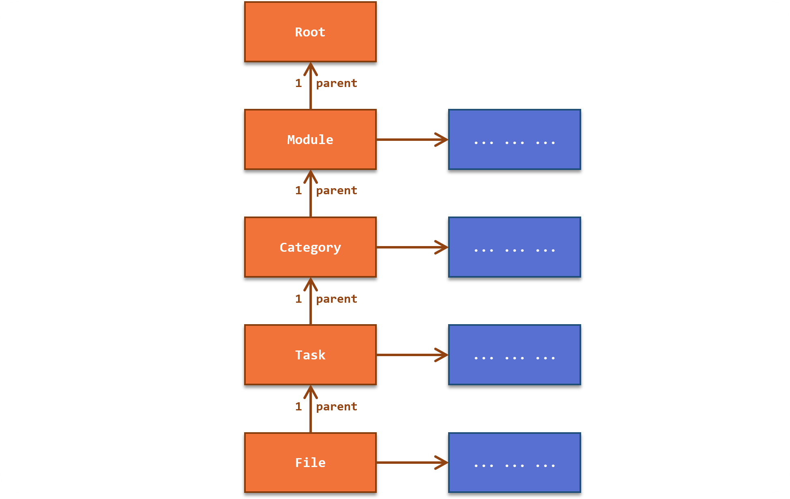   
 <span style="color: green"><small><i>Figure <b>Directory Class Diagram (Basic)</b></i></small></span>   
 <br>

<div>
The <b>Module</b>, <b>Category</b>, <b>Task</b> and <b>File</b> <b>Directories</b> each have their own set of attributes. Also, apart from the <b>File</b> directory, each of them have a corresponding <b><a href="#directory-manager">Directory Manager</a></b> class that stores and manages the operations regarding the <i>child directories</i>. For example, a <code>Module</code> has a <code>CategoryManager</code> class that stores the <i>module</i>'s <i>categories</i>, and manages their operations <i>(such as adding and deleting)</i>.
<br><br>
We will show a more detailed <i>class diagram</i>, as well as describe each of the <b>Directory</b>'s attributes below: 
</div>   
<br>
<p id="directory-class-diagram"></p>

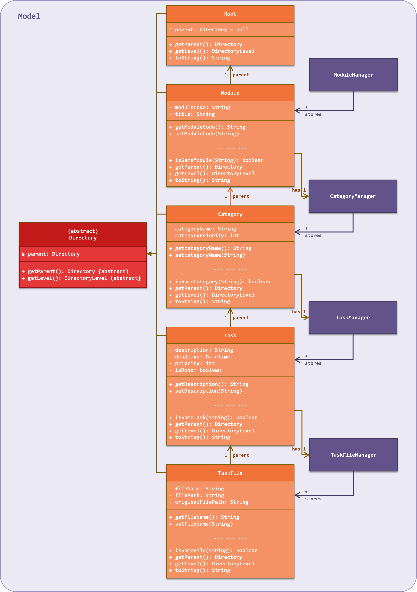    
<span style="color: green"><small><i>Figure <b>Directory Class Diagram</b></i></small></span>   
 <br>


#### **Root**    
<div>
The <b>Root Directory</b> is the <b>base</b> of the entire <b>Directory Tree</b>. Only <b>one</b> <i>root</i> exists in the entire <b>Tree</b>. The <i>root</i> does not have any attributes, and its parent is <code>NULL</code>.
</div>

#### **Module**    
<div>
The <b>Module Directory</b> is the <b>second</b> level of the <b>Directory Tree</b>. It corresponds to a <i>module</i>. A <i>module</i> has a <i>module code</i> and <i>title</i>. It also has a <b>Category Manager</b> which stores <i>categories</i> to categorise the user's <i>tasks</i>, such as "Lecture", "Tutorial" and "Assignment". 
</div>
<div class="alert alert-info">  
<i class="fa fa-info"></i> <b>Info</b> <br>   
In our current implementation, when a user adds a <i>module</i>, the application automatically adds four <i>categories</i> into the <i>module</i>. They are Lecture, Tutorial, Assignment and Lab. These are common <i>categories</i> and are added automatically to improve usability for users, since they do not need to add them on their own.
</div>     

#### **Category**   
<div>
The <b>Category Directory</b> is the <b>third</b> level of the <b>Directory Tree</b>. It corresponds to a <i>category</i>. A <i>category</i> consists of a <i>name</i> and a <i>priority</i> to indicate the importance of the <i>tasks</i> in that <i>category</i>. Each <i>category</i> has a <b>Task Manager</b> that stores the user's <i>tasks</i>.  
</div>

#### **Task**  
<div>
The <b>Task Directory</b> is the <b>fourth</b> level of the <b>Directory Tree</b>. It corresponds to a <i>task</i>. A <i>task</i> has several attributes, namely the <i>description</i>, <i>deadline</i> of the <i>task</i> if any, <i>priority</i> and the <i>done status</i> of the <i>task</i>.  Each <i>task</i> contains a <b>File Manager</b> that stores the <i>task</i>'s <i>files</i>.
</div>  

#### **File**  
<div>
The <b>File Directory</b> is the <b>last</b> level of the <b>Directory Tree</b>. It corresponds to a <i>file</i>. The <i>file</i> must have a <i>file name</i>, <i>file path</i>, and its <i>original file path</i> It does no have a corresponding <b>Directory Manager</b>.     
</div>   
<div class="alert alert-info">  
<i class="fa fa-info"></i> <b>Info</b> <br>   
The <i>original file path</i> is the <i>path</i> to where the <i>original file</i> is taken from in the application. In our current implementation, <b>Nuke</b> will then make a copy of the <i>file</i> and save it into a new location, and the <i>path</i> to the new location is stored in the <i>file path</i> attribute.
</div>
<br>     

[Back To Top](#table-of-contents)    
<br> 

### **2. Directory Manager**   
#### **Overview**     
<div>
The <b>Directory Manager</b> is a collective term used to refer to the <b>Module Manager</b>, <b>Category Manager</b>, <b>Task Manager</b> and <b>File Manager</b>. The <b>Directory Manager</b> manages the storage and operations of the <b>Directory</b> it is managing. For example, the <code>ModuleManager</code> object will manage <code>Module</code> objects. 
</div>

#### **Implementation**    
<div>
The <b>Directories</b> in the <b>Directory Manager</b> are stored in an <code>ArrayList</code>.
<br><br>
The <b>Directory Manager</b> classes also contain very similar methods to carry out operations regarding its <b>Directories</b>. For example, in the <code>ModuleManager</code> class, there are:
<ul>
<li><code>getModule(moduleCode: String)</code> &ndash; Gets a <code>Module</code> object from the <code>ArrayList</code> based on the <code>moduleCode</code> provided</li>
<li><code>add(Module)</code> &ndash; Adds a <code>Module</code> object into the <code>ArrayList</code> of stored <code>Module</code> objects</li>
<li><code>delete(Module)</code> &ndash; Remove a <code>Module</code> object from the <code>Array List</code></li>
<li><code>edit(Module, newModuleCode: String)</code> &ndash; Edits a <code>Module</code> object's <code>moduleCode</code> to a new one</li>
<li><code>filter(moduleKeyword: String)</code> &ndash; Filters for <code>Module</code> objects in the <code>ArrayList</code> with <code>moduleCode</code> that <u>contains</u> the <code>moduleKeyword</code></li>
<li><code>filterExact(moduleKeyword: String)</code> &ndash; Filters for <code>Module</code> objects in the <code>ArrayList</code> with <code>moduleCode</code> that <u>equals</u> the <code>moduleKeyword</code></li>
</ul>
<br>
The <b>Directories</b> and <b>Directory Managers</b> together make up the <a href="#model-component"><b>Model</b> component</a> of the <b>Nuke</b> application.  
</div>   
  
[Back To Top](#table-of-contents)    
<br>   
  
#### **Design Considerations**     
<b>Structure Decision</b>    
- <b>Alternative 1</b>: No <b>Directory Tree</b> structure; have <b>one</b> Task List</b> which stores all the user's <i>tasks</i>       
	- <b>Pros</b>: Implementation-wise will be trivial. Any operations relating to the <i>task</i> can be done directly from the <b>Task List</b>     
	- <b>Cons</b>: The <b>Task List</b> can become too large overtime. It can become messy and unorganised since  categorisation of <i>tasks</i> is not explicitly implemented. Also, it will prevent having duplicated common names. For example, many <i>tasks</i> may have the same <i>task description</i> <b>Tutorial 3</b>.   

- <b>Alternative 2</b>: Have a <b>Directory Tree</b> structure <b>(current implementation)</b>         
	- <b>Pros</b>: The structure is more layered and well-organised. A folder and sub-folder structure is intuitive to the user since it tends to follow how he would normally store and organise their <i>tasks</i>. Duplicated <b>Directory</b> names are also supported &#128522; provided they come from different <i>parent</i> <b>Directories</b>.   
	- <b>Cons</b>: Can be challenging to implement &#128553;. There are many other structures and methods that we need to implement to facilitate the <b>Tree</b> structure. For example, methods to traverse the <b>Tree</b>, and how <b>Directories</b> have knowledge of their <i>parent</i> <b>Directory</b>. For the users, this would mean more commands and features for them to know.    
<br>

<b>Directory Operations</b>    
- <b>Alternative 1</b>: Merge <b>Directory</b> classes with <b>Directory Manager</b> classes        
	- <b>Pros</b>: We will be able to implement one less class for each <b>Directory</b>. Also it may be intuitive at first to combine them since they perform "similar" functions. For example <code>Module</code> and <code>ModuleManager</code> classes both have operations that largely involve <code>Module</code> objects.     
	- <b>Cons</b>: The operations of <b>Directory</b> classes with <b>Directory Manager</b> classes are not exactly similar. <b>Directory</b> classes form the basic structure of the <b>Directories</b>, while the <b>Directory Manager</b> classes manage storing and operating <b>Directories</b>. Merging the two will thus violate Single Responsibility Principle and Separation of Concerns as the merged class will have two different roles.    

- <b>Alternative 2</b>: Have separated <b>Directory</b> classes and <b>Directory Manager</b> classes <b>(current implementation)</b>         
	- <b>Pros</b>: The classes are more specialised and perform more distinct roles, which is an ideal coding practice.   
	- <b>Cons</b>: A separate class needs to be implemented for each of the <b>Directories</b>. Both <b>Directory</b> classes and <b>Directory Manager</b> classes also tend to be very closely associated to each other and increases coupling.     

[Back To Top](#table-of-contents)    
<br> 

### **3. Directory Traverser**    
#### **Overview**    
<div>
The <b>Directory Traverser</b> is a very fundamental feature that utilises the <b><a href="#directory">Directory Tree</a></b> structure of <b>Nuke</b> to carry out its operations. In particular, it plays a pivotal role in the <b><a href="#5-change-directory-command">Change Directory</a></b> command to traverse up and down from the current <b>Directory</b>. 
<br><br>
The <b>Directory Traverser</b> also helps to fill in the missing <i>path</i> attributes in various commands by using the information from the <i>current</i> and <i>parent</i> <b>Directories</b>. For example, if a user is at the <b>Module</b> level, with <i>module code</i> <b>CS2100</b>, and wants to add a <i>category</i>, he does not have to enter the <i>directory path</i>  to the <i>module</i> in the command as such: <code>addc toAdd -m cs2100</code>. Instead, he can just type <code>addc toAdd</code>. This also works when the user is at the <b>Category</b>, <b>Task</b> and <b>File</b> levels.
</div>  

#### **Implementation**    
   
<span style="color: green"><small><i>Figure <b>Directory Traverser Class Diagram</b></i></small></span>   
 <br>

<div>
The <code>DirectoryTraverser</code> class is a static class which has several public static methods. That means other classes can use the <code>DirectoryTraverser</code> class's methods without having to instantiate a <code>DirectoryTraverser</code> object. 
<br><br>
<code>DirectoryTraverser</code> stores the current <i>path</i> information as a Stack. When traversing down to a <i>child</i> <b>Directory</b>, it pushes the <i>child</i> <b>Directory</b> into the Stack. Similarly, when traversing up to its <i>parent</i> <b>Directory</b>, it pops the current <b>Directory</b> out of the Stack. This helps to track what is the current <b>Directory</b>, which will always be at the top of the Stack.
</div>
<br>

    
<span style="color: green"><small><i>Figure <b>Directory Traverser Traverse Down</b></i></small></span>   
 <br>  
 
    
<span style="color: green"><small><i>Figure <b>Directory Traverser Traverse Up</b></i></small></span>   
 <br>  

<div>
As described in the <a href="#overview-2">Overview</a>, the <code>DirectoryTraverser</code> class has <b>two</b> main functions:
<br><br>
<b><u>Traversal</u></b>
<br>
The <code>DirectoryTraverser</code> class contains <b>three</b> main methods to facilitate traversing up and down <b>Directories</b>.  They are:<br>  
<ol>
<li><code>findNextDirectory(nextDirectoryName: String)</code> &ndash; Finds a present <code>Directory</code> in the next <b>Directory</b> level with the matching <code>nextDirectoryName</code></li>
<li><code>traverseDown(nextDirectory: Directory)</code> &ndash; Traverses down to the <code>nextDirectory</code> by pushing the <code>nextDirectory</code> into the <code>directoryStack</code></li>
<li><code>traverseUp()</code> &ndash; Traverses  up to the <i>parent</i> <b>Directory</b> by popping the top <code>Directory</code> from the <code>directoryStack</code></li>
</ol>
<br>
<div class="alert alert-info">  
<i class="fa fa-info"></i> <b>Info</b> <br>   
The <b>Root Directory</b> and the <b>File Directory</b> are the first and last <i>directories</i> in the <b>Directory Tree</b> respectively. If the user attempts to traverse down up the <b>Root Directory</b>, or traverse down a <b>File Directory</b>, an error message will be shown to the user instead. &#128559;
</div>
<br>
The above <b>three</b> methods plays an important role in the <b><a href="#5-change-directory-command">Change Directory</a></b> command.
<br><br>
<b><u>Attributes Matching</u></b>
<br>
Matching attributes to fill in the missing <i>path</i> attributes given by the user is not so straightforward. <code>DirectoryTraverser</code> has to search through each of the <code>Directory</code> in its <code>directoryStack</code> to extract the relevant information.
<br><br>
At times, the user may be at an inadequate <b>Directory</b> level for <code>DirectoryTraverser</code> to fully extract the <i>path</i> information. In this case, <code>DirectoryTraverser</code> has to be able to recognise this, and throw an <b>exception</b> &#128542;. For example, if the user is at the <b>Root</b> level and enters <code>addt do task -c Assignment</code> to add a <i>task</i>, in our current implementation, the following will happen:
<br>
<ol>
<li><code>DirectoryTraverser</code> will attempt to fill in the missing <i>path</i> attribute for the <i>module</i></li>
<li>However, since the user is at the <b>Root</b> level, <code>DirectoryTraverser</code> is unable to fill the missing <i>path</i> to the <i>module</i></li>
<li><code>DirectoryTraverser</code> will throw an <b>exception</b> and an error message is shown to the user to either move to the correct level, or enter the full <b>Directory</b> <i>path</i></li>
</ol>
<br>
To support the attributes matching feature, <code>DirectoryTraverser</code> has <b>2</b> distinct groups of methods, with one method for each <b>Directory</b> level from <b>Root</b> to <b>File</b> <i>(i.e. in total <b>8</b>)</i>. The methods are:
<br>
<ol>
<li><code>getBaseModule()</code> &ndash; Gets the <i>parent</i> <b>Module</b> Directory, or the current <b>Directory</b> if it is at the <b>Module</b> level</li>
<li><code>getBaseCategory()</code> &ndash; Gets the <i>parent</i> <b>Category</b> Directory, or the current <b>Directory</b> if it is at the <b>Category</b> level</li>
<li><code>getBaseTask()</code> &ndash; Gets the <i>parent</i> <b>Task</b> Directory, or the current <b>Directory</b> if it is at the <b>Task</b> level</li>
<li><code>getBaseFile()</code> &ndash; Gets the current <b>Directory</b> if it is at the <b>File</b> level</li>
<li><code>getModuleDirectory(String)</code> &ndash; Gets the <b>Module</b> level <code>Directory</code> after first filling missing <i>path</i> attributes</li>
<li><code>getCategoryDirectory(String, String)</code> &ndash; Gets the <b>Category</b> level <code>Directory</code> after first filling missing <i>path</i> attributes</li>
<li><code>getTaskDirectory(String, String, String)</code> &ndash; Gets the <b>Task</b> level <code>Directory</code> after first filling missing <i>path</i> attributes</li>
<li><code>getFileDirectory(String, String, String, String)</code> &ndash; Gets the <b>File</b> level <code>Directory</code> after first filling missing <i>path</i> attributes</li>
</ol>
<br>
As of the current implementation, the above methods are sufficient for the attributes matching property.
</div>
<br>   
  
[Back To Top](#table-of-contents)    
<br>   

#### **Design Considerations**     
<b>Attributes Matching</b>    
- <b>Alternative 1</b>: Do not have any attribute matching, <i>i.e. missing path attributes are <b>not</b> allowed</i>       
	- <b>Pros</b>: Simple to implement. We only need to check if every <i>path</i> attribute is provided by the user, and that the <b>Directory</b> from the given <i>path</i> exists.     
	- <b>Cons</b>: The user needs to consistently enter the full <i>path</i> to the <b>Directory</b> he is targeting. This can become rather time-consuming and very inconvenient to the user.   
<div class="alert alert-info">  
<i class="fa fa-info"></i> <b>Info</b> <br>   
The commands targeting the <b>File</b> Directroy requires the longest <i>path</i>. For example, the format for the <b>add file</b> command would look something like <code>addf assignment_1 -m ma1521 -c Assignment -t do assignment</code>. Having the user to constantly type such <b><i>long</i></b> commands &#128555; would really inconvenience them.
</div>     

- <b>Alternative 2</b>: Have attribute matching <b>(current implementation)</b>         
	- <b>Pros</b>: User can omit certain <i>path</i> attributes, or the entire <i>path</i> altogether if he is at the correct <b>Directory</b>. Commands would be shorter and can be entered faster, which meets the expectation stated in the <a href="#user-stories">user stories</a>.
	- <b>Cons</b>: A lot harder to implement &#128551;. There are many considerations to be made for the correct implementation of this feature such as how missing attributes can be derived and the correct matching of attributes.   

[Back To Top](#table-of-contents)    
<br> 


## **Command Implementation**  
This section will describe the significant details of how the commands in <b>Nuke</b> are being implemented.  

### **1. Add Command**
#### **Overview**
The **add** feature adds modules, categories, tasks and tags into the Module, Category and Task List respectively.


<span style="color: green"><small><i>Figure <b>Add Command Classes Diagram</b></i></small></span>

#### **1.1. Add Module Command**

The add module feature enable the user to add modules into the Module List.

When the user first requests to execute the `addm` command(*assuming the command format given is valid*) to add a module by providing its name, the application will parse the input after `addm`  command word as the module code. From here, there are **three** possible outcomes:

1. The module specified by the user is not provided by NUS -- No module will added.
2. The module specified by the user is already added -- No module will be added.
3. The module specified by the user is provided by NUS and have not been added -- Module will be added.

#### **Implementation**

This feature is facilitated by the `AddModuleCommand` class which add the modules specified by the user. It overrides the `execute()` method which extends from the abstract `AddCommand` class which extends from the abstract `Command` class.   The `execute()` method's role is to execute the adding module operation and do necessary checks .

The `AddCommand` will first try to call the static method `add` in `ModuleManager`  class, which will try to add the module specified by the user, exception will thrown according the following rules:

1. `DuplicateModuleException` will be thrown if the module specified by the user is contained in the `ArrayList` named `moduleList` in `ModuleManager` class.
2. `ModuleNotProvidedException` will be thrown if the module code specified by the user is not contained in the `HashMap` named `modulesMap` in `ModuleManager` class.

<span style="color: green"><small><i>Figure <b>Add Module Command Class Diagram</b></i></small></span>

#### **Example Usage**

The addition of modules will be illustrated as follows.

James is a user and wants to add the module with the module code of "CS3235". Assume that he has the current modules:

```
+--------------------------------------------------------------------------------------------------+
 NO |  MODULE CODE   |                                 MODULE TITLE
+--------------------------------------------------------------------------------------------------+
 1  |     CS1231     |                             Discrete Structures
 2  |     CS2100     |                            Computer Organisation
 3  |     CS2113     |              Software Engineering & Object-Oriented Programming
+--------------------------------------------------------------------------------------------------+
Total modules: 3
+--------------------------------------------------------------------------------------------------+
```

1. James will simply enter the command `addm cs3235`

   After the input is parsed as an **add module task** and executed, the `AddModuleCommand#execute()` will call `ModuleManager#add()` to add the module cs3235. In the `ModuleManager#add()` method, it will call `ModuleManager#contains()` to check if the module cs3235 exists in the `ArrayList` named `moduleList` , then it will check if the module code "cs3235" is a key in the `HashMap` named `modulesMap`, after all, it will instantiate an `Module` object with the module code "CS3235" and respective title "Computer Security", then add the object into the `moduleList`.

2. James receive the following feedback:
```
   root :
   addm cs3235
   SUCCESS!! Module CS3235 Computer Security has been added.
   
   root :
   lsm
   Here are what you are looking for...
   
   +--------------------------------------------------------------------------------------------------+
    NO |  MODULE CODE   |                                 MODULE TITLE
   +--------------------------------------------------------------------------------------------------+
    1  |     CS1231     |                             Discrete Structures
    2  |     CS2100     |                            Computer Organisation
    3  |     CS2113     |              Software Engineering & Object-Oriented Programming
    4  |     CS3235     |                              Computer Security
   +--------------------------------------------------------------------------------------------------+
   Total modules: 4
   +--------------------------------------------------------------------------------------------------+
```

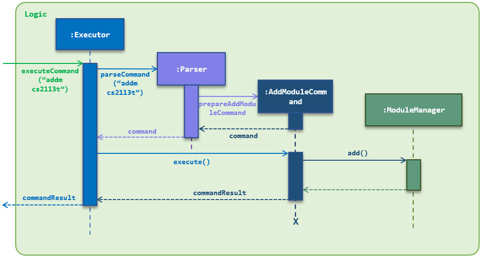

Below is a *sequence diagram* to illustrate the above example scenario.  


#### **1.2. Add Category and Task Commands**

Since add category and add task feature are implemented in a similar pattern, they can be explained together.

The add category/task enable the user to add category/task/tag into Category/Task/Tag List.(One to one correspondence, which means the user can only add category to Category List, task to Task List).

When the user first request to execute the **add** command*(assuming the command format given is valid)* to add a category/task by providing its name, the application will parse the input after `addm` /`addc` command word as the name for category/task. From here, there are **three** possible outcomes:

1. The specified upper parent directory does not exist. -- No category/task will be added.
2. The name of the specified category/task already exist. -- No category/task will be added.
3. The specified upper parent directory exist and the name of the specified category/task does not exist. -- The specified category/task will be added.

#### **Implementation**

This feature is facilitated by the `AddCategoryCommand` and `AddTaskCommand` class which add the corresponding category or task respectively.

The above-stated two classes overrides the `execute()` method which extends from the abstract `AddCommand` class which extends from the abstract `Command` class. The `execute()` method's role is to execute the adding category/task operation and do necessary checks.

The `AddCategoryCommand` and `AddTaskCommand` will first call the `getParentDirectory()` method to get the parent directory, then it will instantiate a `Category`/`Task` object and try to call `add` method in their respective parent directory class to add the new object, exception will be thrown according to the following rules:

1. `ModuleNotFoundException` will be thrown if the specified module code does not exists in the `ArrayList` of Module when adding a new category or task.
2. `CategoryNotFoundException` will be thrown if the specified category name does not exists in the `ArrayList` of Category in `CategoryManager` in `Module` when adding a new task.
3. `IncorrectDirectoryLevelException` will be thrown if the user is performing the`addc`/`addt` command in the wrong directory without specifying their full parent directories.(For example, when user trying to execute `addc` in a `Root`/`Task` directory, or trying to execute `addt`  in a `Root`/`Module` directory)
4. `DuplicateTaskException`/`DuplicateCategoryException` will be thrown if the name of the category/task already exist in the current directory.

Below are the class-diagram for the involved classes:

```
to-do: add the class-diagram
```

#### **Example Usage**

The addition process for *category* and *task* are similar. In this example, the addition process for *category* will be illustrated as a series of steps.

James is a user and wants to add a *category* named  "misc" under the *module* cs3235. Assume that he has the current Module List and current Category List in the module cs3235:

```
root :
lsm
Here are what you are looking for...

+--------------------------------------------------------------------------------------------------+
 NO |  MODULE CODE   |                                 MODULE TITLE                       
+--------------------------------------------------------------------------------------------------+
 1  |     CS1231     |                             Discrete Structures                    
 2  |     CS2100     |                            Computer Organisation                   
 3  |     CS2113     |              Software Engineering & Object-Oriented Programming    
 4  |     CS3235     |                              Computer Security                     
+--------------------------------------------------------------------------------------------------+
Total modules: 4
+--------------------------------------------------------------------------------------------------+

root :
lsc -m cs3235
Here are what you are looking for...

+--------------------------------------------------------------------------------------------------+
 NO |     MODULE     |                                CATEGORY                                | PTY
+--------------------------------------------------------------------------------------------------+
 1  |     CS3235     |                               Assignment                               |  4
 2  |     CS3235     |                                  Lab                                   |  3
 3  |     CS3235     |                                Lecture                                 |  1
 4  |     CS3235     |                                Tutorial                                |  2
+--------------------------------------------------------------------------------------------------+
Total categories: 5
+--------------------------------------------------------------------------------------------------+
```

1. James has two choices:

   1. enter `cd cs3235` to enter the module directory then enter `addc misc` to add the category.
   2. enter `addc misc -m cs3235` to add the category at the root directory.

   Suppose James use the first method, after the second input, the input is parsed as an **add task** command and executed, the `AddCategoryCommand#execute()` will call `AddCategoryCommand#getParentDirectory()` to get the current parent directory, then it will instantiate an `Category` object with the name "misc". After which `CategoryManager#add()` will be called to add the new object. In the `CategoryManager#add()` method, it will call `CategoryManager#contains()` method to check if the current parent directory contains the category with name "misc", finally add the object into the `ArrayList` of `categoryList`.

2. James receive the following feedback:

   ```
   root :
   addc misc
   SUCCESS!! Category misc is created.
   ```


Below is a *sequence diagram* to illustrate the above example scenario.  

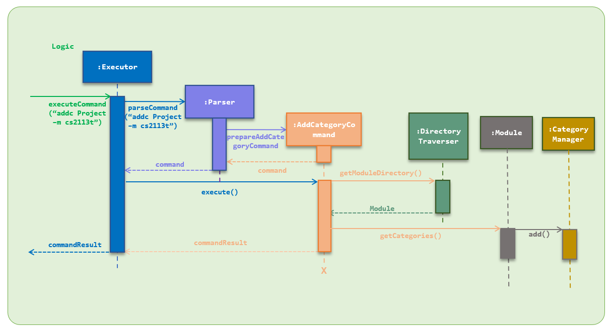

<span style="color: green"><small><i>Figure <b>Add Module Command Sequence Diagram</b></i></small></span>

<br><br>

### **2. List Command**  

#### **Overview**  

The **List** feature lists out *modules*, *categories* and *tasks* from the Module, Category and Task List respectively.   
When the user first requests to execute the **list** command to list out directory by providing its name, the application will first filter for directories with matching names. From here, there are **three** possible outcomes:  

1. There are **no** matches --  Nothing is listed out.
2. There are matches -- The list of matches will be shown to the user.

#### **Implementation**  


<span style="color: green"><small><i>Figure <b>List Command Class Diagram</b></i></small></span>

The `ListModuleCommand`, `ListCategoryCommand`, `ListTaskCommand`, `ListFileCommand`, `DueCommand`, `ListModuleTaskCommand`, `ListTaskSortedCommand` classes in the application facilitates this **list** feature. They are in charge of listing out *modules*, *categories*, *tasks*, *file*s, all *task*s at the specified time period, *task*s of *module* in ascending order of deadline and all undone *task*s sorted by deadline or priority respectively. <br>  

As shown in the figure above, those seven classes each extends from the abstract `ListCommand` class.  They also [override](#) the ancestor `Command` class's `execute()` method, which role is to list out desired entries to the user. <br>


The `ListCommand` class in turn extends the `FilterCommand` abstract class. The `FilterCommandClass` contains the following vital methods for filtering:  

- `createFilteredModuleList()` -- Creates an `ArrayList` of the filtered *modules*.  
- `createFilteredCategoryist()` -- Creates an `ArrayList` of the filtered *categories*.  
- `createFilteredTaskList()` -- Creates an `ArrayList`of the filtered *tasks*.  

Lastly, the `FilterCommand` class extends the abstract `Command` class that contains the `execute()` method to execute the actual **list** command.  

#### **Example Usage**  

The listing process for *modules*, *categories*, *tasks*, *file*s, all *task*s at the specified time period, *task*s of *module* in ascending order of deadline and all undone *task*s sorted by deadline or priority are similar. In this example, the listing process for *modules* will be illustrated as a series of steps.  <br>
James is a user and wants to list out all of his *modules* with *moduleCode* begin with "CS". Assume that he has the current Module List: 

```
+--------------------------------------------------------------------------------------------------+
 NO |  MODULE CODE   |                                 MODULE TITLE                                 
+--------------------------------------------------------------------------------------------------+
 1  |     CS2101     |             Effective Communication for Computing Professionals              
 2  |    CS2113T     |              Software Engineering & Object-Oriented Programming              
 3  |     CS3230     |                      Design and Analysis of Algorithms                       
 4  |     CS3235     |                              Computer Security                               
 5  |    GEH1036     |                           Living with Mathematics                            
 6  |    IFS4103     |                         Penetration Testing Practice                         
+--------------------------------------------------------------------------------------------------+
Total modules: 6
+--------------------------------------------------------------------------------------------------+
```

<br>

James will first enter the command to list out *modules* with *moduleCode* begin with "CS":  
	`lsm CS`  
After the input is parsed as a **list module** command and executed, the `ListModuleCommand#execute()` will call `FilterCommand#createFilteredModuleList()` to create the filtered list of *modules* containing the *Modules* with *moduleCode* begin with "CS". `ListModuleCommand#execute()` will then call its parent class's method `FilterCommand#sortModuleList(filteredModuleList)` to sort the *modules* by their respective moduleCode. And finally the sorted Arraylist of *Module*s is used to instantiate a CommandResult object and returned, and `ui#showResult(commandResult)` will be called to show the result to the user. And Listing process ends.

Below is a *sequence diagram* to illustrate the above example scenario.  

   
<span style="color: green"><small><i>Figure <b>List Module Command Sequence Diagram</b></i></small></span>

<br><br>

### **3. Delete Command**  
#### **Overview**  
<div>
The <b>delete</b> command deletes <i>directories</i> from their respective lists. For example, a user can delete a <i>module</i> from the <b>Module List</b>. <br>
When the user first requests to execute the <b>delete</b> command to delete a <i>directory</i> by providing its <i>name</i>, the <b>Nuke</b> application will first filter for <i>directories</i> with matching <i>names</i>. From here, there are <b>three</b> possible outcomes:  

<ol>  
<li>There are <b>no</b> matches &ndash;  Nothing is deleted.</li>  
<li>There is <b>one</b> match &ndash; A prompt will be given to the user to confirm the deletion.</li>  
<li>There are <b>multiple</b> matches &ndash; The list of matches will be shown to the user, and the user chooses which ones to delete. A further prompt will be given to confirm the deletion(s).</li>  
</ol>

</div>

#### **Implementation**  
<br>

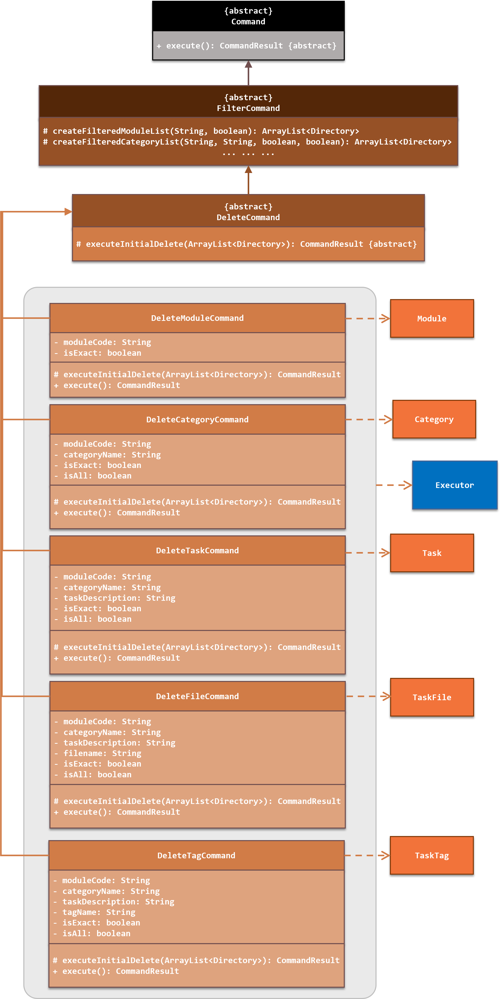     
<span style="color: green"><small><i>Figure <b>Delete Command Class Diagram</b></i></small></span>   
    
<br>

<div>
The <b>delete</b> commands are similar to each other, and targets to delete <i>directories</i> of a specific <i>directory level</i>. For example, the <code>DeleteTaskCommand</code> class will only delete <i>tasks</i> <i>(and not modules, categories or files)</i>.
<br><br>
Like the <b><a href="#2-list-command">list</a></b> commands, the <b>delete</b> commands function with a filter property. That is to say, the <b>delete</b> commands will first filter for the possible <i>directories</i> to delete based on the user-provided <i>keywords</i>. If there are <b>multiple</b> matches after the filtering, the user will be prompted to choose which of the <i>directories</i> they wish to delete.
<br><br>
Since the <b>delete</b> commands are quite similar to the <b>list</b> commands, the <code>DeleteCommand</code> class extends from the same <code>FilterCommand</code> class as the <code>ListCommand</code> class.  The <code>DeleteCommand</code> class thus inherits the same methods in the <code>FilterCommand</code>  class.
<br><br>
Each of the <b>delete</b> commands extends from the <i>abstract</i> <code>DeleteCommand</code> class. The <code>DeleteCommand</code> class has an <i>abstract</i> method, <code>executeInitialDelete()</code>, and each of the <b>delete</b> commands must implement this method. The role of <code>executeInitialDelete()</code> is to prepare the necessary prompt to show the user, depending on the number of filtered matches <i>(See <a href="#overview-2">above</a>)</i>.
<br><br>

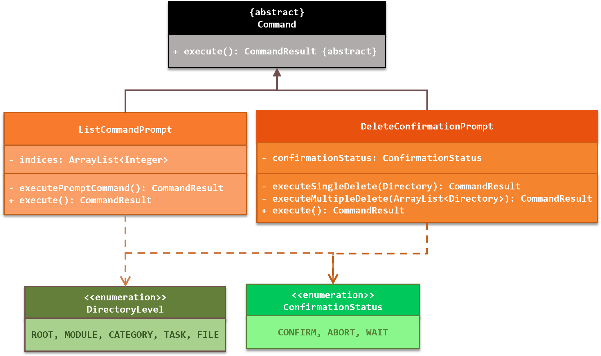      
<span style="color: green"><small><i>Figure <b>Prompt Command Class Diagram</b></i></small></span>   

<br> 
Two <b>prompt</b> commands are involved in the deletion process:<br>  
<ol>  
<li><code>ListNumberPrompt</code> manages the event after the user has input the <i>list numbers</i> of the <i>directories</i> to delete when there are <b>multiple</b> matches.</li>  
<li><code>DeleteConfirmationPrompt</code> manages the event after the user has responded to the confirmation prompt to delete the <i>directories</i></li>  
</ol>

<div class="alert alert-info">  
<i class="fa fa-info"></i> <b>Info</b> <br>   
The <code>ListNumberPrompt</code> class will only be executed if there are <b>multiple</b> matches. Otherwise, only the 
corresponding <code>DeleteCommand</code> and <code>DeleteConfirmationPrompt</code> objects will be executed in the deletion process.
</div>   
<br>
The deletion process can thus be broken down into <b>3</b> stages. We provide for you the relevant <i>sequence diagrams</i> to help you to see how each stage works in our current implementation of the <b>delete</b> command.
</div>  


<div>
<big><big><big><big><big style="color: green">&#10102;</big></big></big></big></big>
The user, <i>say Peter in this example</i>,  will first request the <i>directory(s)</i> he wishes to be deleted. Assume Peter currently has these <i>modules</i> in his <b>Module List</b>:
</div><br>

```
+--------------------------------------------------------------------------------------------------+
 NO |  MODULE CODE   |                                 MODULE TITLE                                 
+--------------------------------------------------------------------------------------------------+
 1  |     CS1231     |                             Discrete Structures                              
 2  |     CS2101     |             Effective Communication for Computing Professionals              
 3  |     CS2102     |                               Database Systems                               
 4  |    CS2113T     |              Software Engineering & Object-Oriented Programming              
 5  |     CS3235     |                              Computer Security                               
 6  |    GEH1036     |                           Living with Mathematics                            
 7  |    IFS4103     |                         Penetration Testing Practice                         
+--------------------------------------------------------------------------------------------------+
Total modules: 7
+--------------------------------------------------------------------------------------------------+
```
<br>
<div>
Now, Peter wishes to delete <i>modules</i> <b>CS1231</b> and <b>CS2102</b>. He enters <code>delm cs</code> to execute the command.
<br><br>
The <b>Nuke</b> <code>Parser</code> will parse the input as a <b>delete module</b> command. The <code>DeleteModuleCommand</code> object is instantiated and executed. The object will first filter <i>modules</i> containing the <i>keyword</i> "<b>cs</b>". This is done by the <code>FilterCommand#createFilteredModuleList()</code> method. Then, <code>DeleteModuleCommand</code> will call its own <code>executeInitialDelete(filteredList)</code> method to prepare the prompt to ask Peter to choose which <i>modules</i> he would like to delete. 
</div>
<br>

The <i>sequence diagram</i> for <b>stage</b> <big><big><big style="color: green">&#10102;</big></big></big>:<br>   

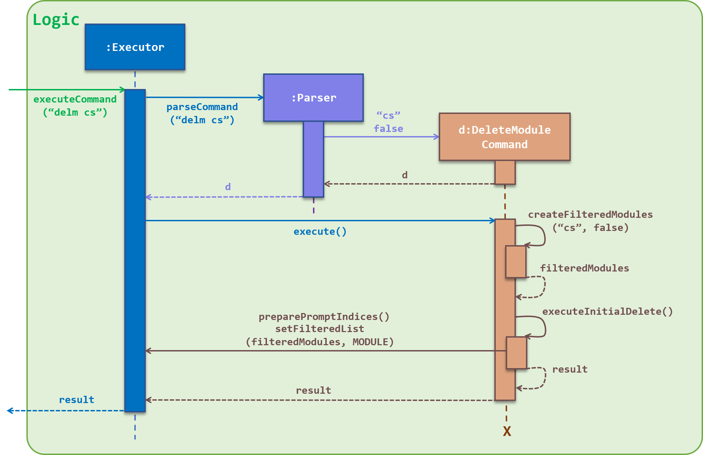  
 <span style="color: green"><small><i>Figure <b>Delete Command Sequence Diagram 1</b></i></small></span>   

<div>
<big><big><big><big><big style="color: green">&#10103;</big></big></big></big></big>
Peter receives the following prompt: 
</div>

```  
Multiple matching modules were found.
+--------------------------------------------------------------------------------------------------+
 NO |  MODULE CODE   |                                 MODULE TITLE                                 
+--------------------------------------------------------------------------------------------------+
 1  |     CS1231     |                             Discrete Structures                              
 2  |     CS2101     |             Effective Communication for Computing Professionals              
 3  |     CS2102     |                               Database Systems                               
 4  |    CS2113T     |              Software Engineering & Object-Oriented Programming              
 5  |     CS3235     |                              Computer Security                               
+--------------------------------------------------------------------------------------------------+
Total modules: 5
+--------------------------------------------------------------------------------------------------+

Enter the list number(s) of the modules to delete.
```
<div>
He then proceeds to enter the corresponding  list numbers <code>1 3</code> to delete  <i>modules</i> <b>CS1231</b> and <b>CS2102</b>.  
<br>  <br>
<div class="alert alert-warning">  
<i class="fa fa-exclamation"></i> <b>Note</b> <br>   
Since there are <b>multiple</b> matches,  the application will first request for the user to choose the <i>directories</i> he wants to delete. If there is only a <b>single</b> match, this stage is skipped, and the application will continue at <b>stage</b> <big><big><big style="color: green">&#10104;</big></big></big>
</div>   
<br>
After the <code>Parser</code> has parsed the list numbers, the <code>ListNumberPrompt</code> object is constructed. <code>ListNumberPrompt</code> will prepare the prompt for the delete confirmation, and then calls its <code>executePromptConfirmation(filteredList, MODULE)</code> method.  
</div>   

This is the <i>sequence diagram</i> for <b>stage</b> <big><big><big style="color: green">&#10103;</big></big></big>:<br>   

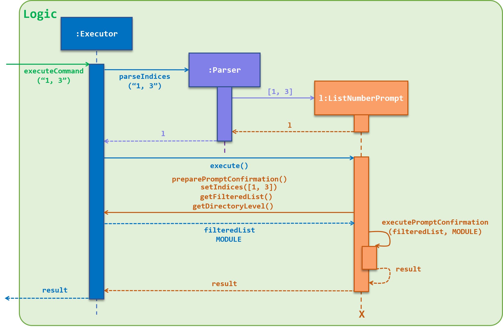  
 <span style="color: green"><small><i>Figure <b>Delete Command Sequence Diagram 2</b></i></small></span>   

<div>
<big><big><big><big><big style="color: green">&#10104;</big></big></big></big></big>
Peter receives the confirmation prompt: 
</div>

```  
Confirm delete these modules?
CS1231 Discrete Structures
CS2102 Database Systems
```

<div>
He enters <code>yes</code> to confirm the deletion.
<br><br>
At the backend, the <code>Parser</code> will parse the confirmation, and constructs the <code>DeleteConfirmationPrompt</code> object. After getting the list of <i>modules</i> to delete, <code>DeleteConfirmationPrompt</code> then calls <code>executeMultipleDelete(filteredList, MODULE)</code> to delete Peter's selected <i>modules</i> from his <b>Module List</b>.  
</div>   

Below is the <i>sequence diagram</i> for <b>stage</b> <big><big><big style="color: green">&#10104;</big></big></big>:<br>   

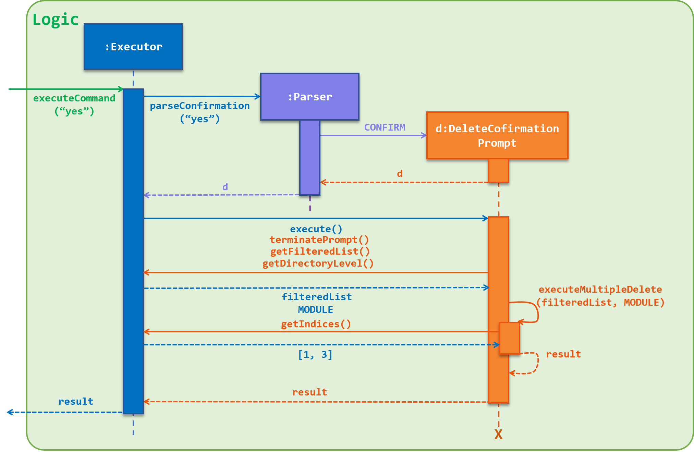  
 <span style="color: green"><small><i>Figure <b>Delete Command Sequence Diagram 3</b></i></small></span>   

<br>
<div>
Peter receives the final message:<br><br>    
</div>

```
SUCCESS!! Module(s) have been deleted.
```

<div>    
and the delete process ends.  
</div>
​    

[Back To Top](#table-of-contents)    

#### **Design Considerations**     
<b>Filtering for Deletion</b>    
- <b>Alternative 1</b>: Do not allow filtering for deleting <i>directories</i>       
	- <b>Pros</b>: Easy to implement. We would only have to check if the <i>directory</i> exists, and then delete it from its respective list.     
	- <b>Cons</b>: Multiple deletions would not be supported. User has to delete one <i>directory</i> at a time, and can be tedious, especially if the user wants to delete several <i>directories</i> with the similar names.     
- <b>Alternative 2</b>: Allow filtering for deleting <i>directories</i> <b>(current implementation)</b>         
	- <b>Pros</b>: User can delete multiple <i>directories</i> at the same time with ease. This is especially useful when deleting <i>directories</i> with similar names, such as deleting a set of <i>tasks</i> with <i>descriptions</i> starting with "<b>tutorial</b>".     
	- <b>Cons</b>: Relatively harder to implement. &#128551;     
<br>

<b>Prompts for Deletion</b>  
- <b>Alternative 1</b>: No prompts for deletion       
	- <b>Pros</b>: Easy to implement. Deletion process will be fast! &#128513; Simply search for the <i>directories</i> and then delete them.
	- <b>Cons</b>: The user may accidentally delete the <b>wrong</b> <i>directory</i>! &#128561; <small><i>(although may still be undone with the <b>undo</b> command)</i></small> This is made worse if a wrong deletion is made during <b>multiple</b> deletions. 
- <b>Alternative 2</b>: Prompts are enabled <b>(current implementation)</b>    
	- <b>Pros</b>: User has another chance to choose to confirm the deletion. &#128517; This reduce the chance of accidental deletions happening.
	- <b>Cons</b>: Deletion process is now longer. The user has to go through another layer of confirmation despite being sure that he he deleting the correct <i>directories</i> <small>(but who knows?)</small>. Moreover, we will have a harder time to implement the <b>delete</b> command, since it has now become multi-staged. Considerations have to be made to counter scenarios with <b>zero</b>, <b>one</b> or <b>more</b> matches after filtering. We will also have to consider how the <code>Parser</code> will be able to recognise if the user's input is a regular command, or an input corresponding to a prompt for list number, or a prompt for delete confirmation.  


[Back To Top](#table-of-contents)    

<br><br>

### **4. Edit Command**   
#### **Overview**    
<div>   
The <b>edit</b> command edits the attributes of a <i>directory</i>. For example, user can edit a <i>category</i>'s <i>name</i> and <i>priority</i>. For <i>tasks</i>, the user is also able to mark them as done.   
</div>    

#### **Implementation**     
<br>   

   
 <span style="color: green"><small><i>Figure <b>Edit Commands Class Diagram</b></i></small></span>   
 <br>  
<div>   
The <b>edit</b> commands all work in a similar manner. As seen in the <i>class diagram</i> above, each of the <b>edit</b> commands extends from the <i>abstract</i> <code>EditCommand</code> class. The <code>EditCommand</code> class has an <i>abstract</i> method, <code>toEdit(Directory)</code>, which is to be implemented by each of the <b>edit</b> commands. 
<br><br>
The <b>edit</b> command will first checks if the attribute String exceeds a fixed length by its own  <code>isExceedLengthLimit()</code> method <i>(See <a href="design-considerations-1">here</a> for the considerations of the length limit)</i>. It then calls <code>DirectoryTraverser</code> class to get the appropriate <code>Directory</code> to edit.    
<br><br>   
<div class="alert alert-info">  
<i class="fa fa-info"></i> <b>Info</b> <br>   
If the attribute String <b>exceeds</b> the length limit, an <b>exception</b> will be thrown &#128528; and the user will be shown an error message.  
</div>   
<br>  
In addition, for <code>EditCategoryCommand</code> and <code>EditTaskCommand</code>, it will fill in any missing attributes not specified by the user in their input. This is done through the command's <code>fillAttributes()</code> method.  
<br><br>
Finally, the <b>edit</b> command will perform the <code>edit()</code> method to edit the <code>Directory</code>. 
</div>    

<div class="alert alert-info">  
<i class="fa fa-info"></i> <b>Info</b> <br>   
The <code>Parser</code> object also helps to check if the user's input contains attributes of the <i>directory</i> to edit. For example, if a user executes the <b>edit module</b> command, but does not enter a <i>new module code</i> to be edited, the application will prompt the user to enter a <i>new module code</i>.  
</div>   
<br>    

An example <i>sequence diagram</i> is shown below when a user requests to edit a <i>category</i>:<br>       
    
<span style="color: green"><small><i>Figure <b>Edit Command Sequence Diagram</b></i></small></span>   
<br>   

[Back To Top](#table-of-contents)     
<br>  

#### **Design Considerations**     
<b>Editing Task</b>  
- <b>Alternative 1</b>: Merge <code>EditTaskCommand</code> class with <code>MarkAsDoneCommand</code> class     
	- <b>Pros</b>: There is one less class to implement. Also, the user does not need to remember another <i>command word</i>.  
	- <b>Cons</b>: While there may be one less <i>command word</i>, there may be one more <i>prefix</i> for the user to remember as well. Also, marking a <i>task</i> as done seems to be more specific compared to changing the attributes of the <i>task</i> such as its <i>description</i> and <i>deadline</i>.   
- <b>Alternative 2</b>: Have separate <code>EditTaskCommand</code> and <code>MarkAsDoneCommand</code> classes <b>(current implementation)</b>        
	- <b>Pros</b>: Have a more specialised class just to mark user's <i>tasks</i> as done. Easier to implement and differentiates from the standard <code>EditTaskCommand</code>.      
	- <b>Cons</b>: There is one more <i>command word</i> for the user to remember.          
<br>   


<b>Edit Multiple Attributes</b>  
- <b>Alternative 1</b>: User can only edit one attribute of a <i>directory</i> at a time       
	- <b>Pros</b>: May be easier to implement. Checking that the user has provided an attribute to edit is also simple <i>(just check if the attribute is empty)</i>.  
	- <b>Cons</b>: The user may want to edit more than one attributes at the same time. For example, the user may want to change both the <i>name</i> and <i>priority</i> of a <i>category</i>. This means that the user will have to execute the <b>edit category</b> command twice, which is not efficient.
- <b>Alternative 2</b>: User can edit any number for attributes of a <i>directory</i> at a time <b>(current implementation)</b>        
	- <b>Pros</b>: The user does not need to keep executing the <b>edit</b> command when editing more than one attribute.    
	- <b>Cons</b>: Possibly slightly harder to implement. We now have to check if the user has provided at least one attribute to be edited. Also, we need to be able to efficiently extract the individual attributes from the user's input. However, this could be made easier by grouping and matching the attributes using <b>Java</b>'s <b>RegEx</b> patterns.           


[Back To Top](#table-of-contents)    
<br>  
<br>  

### **5. Change Directory Command**   
#### **Overview**    
<div>  
The <b>change directory</b> command traverses the user up and down the <b>Directory Tree</b>, much like how the Linux Shell operates. In other words, the user enters the <i>directory name</i> to traverse to that <i>directory</i>, or <code>..</code> to traverse to the parent <i>directory</i>  
</div>   

#### **Implementation**     
<div>   
The <b>change directory</b> command uses various methods from the <code>DirectoryTraverser</code> class in its execution. <br><br>
If the user wants to traverse down to a <i>directory</i>, the <code>ChangeDirectoryCommand</code> will call <code>DirectoryTraverser#findNextDirectory(nextDirectoryName)</code> to get the <code>Directory</code> to traverse to. Then, <code>ChangeDirectoryCommand</code> will call <code>DirectoryTraverser#ftraverseDown(nextDirectory)</code> to move the user to that <i>directory</i>.<br><br>
If the user want to traverse up from the current <i>directory</i> instead, <code>ChangeDirectoryCommand</code> will call <code>DirectoryTraverser#traverseUp()</code> to bring the user back to the <i>parent directory</i>.   
</div>  
<div class="alert alert-info">  
<i class="fa fa-info"></i> <b>Info</b> <br>   
The <b>Root Directory</b> and the <b>File Directory</b> are the first and last <i>directories</i> in the <b>Directory Tree</b> respectively. If the user attempts to traverse down up the <b>Root Directory</b>, or traverse down a <b>File Directory</b>, an error message will be shown to the user instead. &#128550;
</div> <br>   

Shown below is the <i>sequence diagram</i> when a user executes the <b>change directory</b> command to traverse down to another <i>directory</i>.<br>      
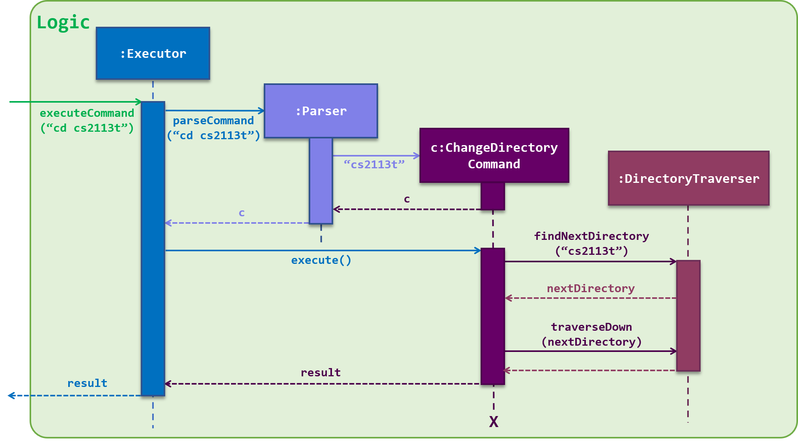    
 <span style="color: green"><small><i>Figure <b>Change Directory Command Sequence Diagram</b></i></small></span>   
<br>   

[Back To Top](#table-of-contents)    
<br>    

#### **Design Considerations**     
<b>Traversal Method</b>  
- <b>Alternative 1</b>: User can only traverse one level at a time  <b>(current implementation)</b>    
	- <b>Pros</b>: Simple to implement. Only need to consider getting the direct <i>parent</i> or <i>child directory</i>.   
	- <b>Cons</b>: User may have to keep executing the <b>change directory</b> command just to reach their desired <i>directory</i>, especially if the user's current <i>directory</i> is "far" from the destination <i>directory</i>.    
- <b>Alternative 2</b>: User can traverse more than one level at a time, similar to Linux Shell.     
	- <b>Pros</b>: Saves user time from having to possibly execute the <b>change directory</b> command multiple times. User can simply enter <code>cd directory1/directory2/directory3</code> and move four <i>directory levels</i> down.      
	- <b>Cons</b>: Much harder to implement as we need to consider how the split the String into individual <i>directory names</i>. Furthermore, we have to consider the case if the provided <i>directory name</i> contains <code>/</code>, and how we will implement a method to differentiate the <code>/</code> in the <i>name</i> from a <code>/</code> in the <i>directory path</i>.      

[Back To Top](#table-of-contents)    
<br>  <br>  

### **6. Open File Command**    
#### **Overview**    
<div>  
The <b>open file</b> command opens up the <i>file(s)</i> of a <i>task</i> specified by the user. User can choose whether to open a single <i>file</i> in the <i>task</i>, or <b>all</b> the <i>files</i> in the <i>task</i>.  
</div>   

#### **Implementation**     
<div>
The implementation of the <b>Open File</b> command uses two important <b>Java APIs</b> &ndash; <code>java.io.File</code> and <code>java.awt.Desktop</code>. The first <b>API</b> is responsible for operations involving file access, while the second <b>API</b> is used to open the file to the Desktop. <br><br>  

The <code>OpenFile</code> object first obtains the list of <i>files</i> from the <i>task</i> to open via the <code>OpenFile#getFilesToOpen()</code> method. Then, <code>OpenFile</code> executes the <code>OpenFile#openFiles()</code> method to open each of the <i>files</i> in the list. 
</div><br>   

<div class="alert alert-info">  
<i class="fa fa-info"></i> <b>Info</b> <br>   
If there is an error opening a particular <i>file</i> in the list &#128534;, the opening process will not be terminated immediately. Instead, the application will continue to open the rest of the <i>files</i> in the list. <br>
After it has gone through the list, it will then show the user the <i>files</i> that were not opened due to an error.
<br><br>
This is done by collecting the <i>file names</i> of the failed to open <i>files</i> into a String, and thereafter throw an <b>exception</b> with the String of </i>file names</i> as the message.
</div> <br>   
Below is a <i>sequence</i> diagram of how the <b>open file</b> command operates:<br>   

    
 <span style="color: green"><small><i>Figure <b>Open File Command Sequence Diagram</b></i></small></span>   


[Back To Top](#table-of-contents)    
<br>  

#### **Design Considerations**     
<b>Allow opening of multiple files</b>  
- <b>Alternative 1</b>: User can open only one file at a time   
	- <b>Pros</b>: Simple to implement. Just search for the corresponding <b>File Directory</b>, get the <i>file path</i>, then open the real file in that <i>path</i>.    
	- <b>Cons</b>: User would usually want to open all or most of the <i>files</i> attached to the <i>task</i>. Opening each <i>file</i> one by one will reduce the ease of using the application.     
- <b>Alternative 2</b>: User can choose which <i>files</i> they want to open from a list of <i>files</i> shown to them  
	- <b>Pros</b>: User can open exactly the <i>files</i> that they require at the moment.      
	- <b>Cons</b>: Much harder to implement as we need to consider how the process to prompt the user to choose the <i>files</i> would be enforced. Thereafter, we need to check if the selection exists in the list of <i>files</i>.    
- <b>Alternative 3</b>: User can choose to open a specified <i>file</i>, or all the <i>files</i> of the <i>task</i> <b>(current implementation)</b>   
	- <b>Pros</b>: User now has a choice, and can choose the best between two options.   
	- <b>Cons</b>: User now has to close the unwanted <i>files</i> that was opened in the process, which may inconvenience the user.   

[Back To Top](#table-of-contents)    
<br>  <br>  

### **7. Info Command**    
#### **Overview**    
<div>  
The <b>info</b> command shows the information of the <i>current directory</i> that the user is in. For example, when in the <b>Module</b> directory, the <b>info</b> command will show the <i>module code</i>, <i>module title</i> and the <i>module</i>'s <i>category list</i> to the user.  
</div>  

#### **Implementation**     
<div>
The implementation of this command is quite straightforward. <br>
The <code>InfoCommand</code> object will call for the <code>DirectoryTraverser</code> object to get the current <code>Directory</code>. Then, the information of the <code>Directory</code> is obtained by calling <code>Directory#toString()</code>. The <i>list</i> to show is generated by the <code>InfoCommand#getListToShow()</code> method. <br>
These information will eventually be shown to the user through the <code>Ui</code>.
</div>  

The <i>sequence</i> diagram of what happens when a user executes the <b>info</b> command is as illustrated:<br>   
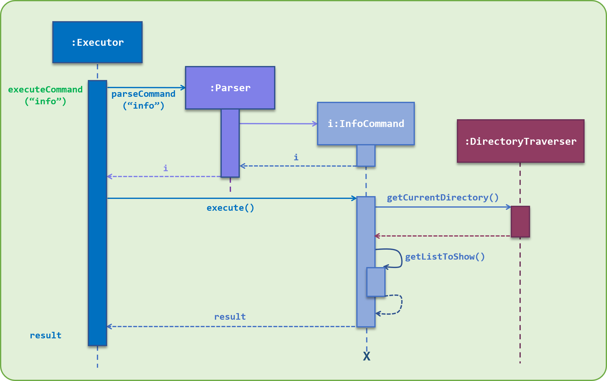    
 <span style="color: green"><small><i>Figure <b>Info Command Sequence Diagram</b></i></small></span>   

[Back To Top](#table-of-contents)    
<br>  <br>  

### **8. Undo and Redo Commands**    
#### **Overview**     
<div>
The <b>undo</b> and <b>redo</b> commands work hand in hand with each other. The <b>undo</b> command undoes a <i>change</i> made to the <b>Directory List</b>. <i>Change</i> here refers to adding, deleting or editing items to the <i>list</i>. The <b>redo</b> command reverts the effect of the <b>undo</b> command.   
</div>  

#### **Implementation**     
<div>
The state of the <i>directories</i> is being maintained by the <code>ScreenShotManager</code> class. This is done via two <b>stacks</b>, one for <b>undo</b>, and the other for <b>redo</b>.  <br><br>

When the application starts, both stacks are empty. After the applications loads the saved <i>directory list file</i>, the current state of the <i>directories</i> is pushed into the <b>undo</b> stack. 
</div>  
        

<br>   <br>  
<div>
When a <i>change</i> is made to the <i>list</i> from a successful add, delete or edit command, the <b>new</b> state is  pushed into the <b>undo</b> stack. This is done by the <code>ScreenShotManager</code>'s <code>saveScreenShot()</code> method.  
<br>The new state is also saved by the application. See <a href="#storage-implementation">here</a> to find out more about the storage implementation.
</div>  


<br>   <br>  
<div>
If the user calls for the <b>undo</b> command, the top-most state in the <b>undo</b> stack is removed and pushed into the <b>redo</b> stack. Then, the <i>list</i> will reload to the current top-most state in the <b>undo</b> stack, which is actually the previous state. All of these are done by the <code>ScreenShotManager</code>'s <code>undo()</code> method.  
</div>  


<br>   <br>   
<div>
Conversely, If the user calls for the <b>redo</b> command, the top-most state in the <b>redo</b> stack is removed and pushed back into the <b>undo</b> stack. Then, the <i>list</i> will reload to the current top-most state in the <b>undo</b> stack, which is actually the state which was previously undone. These are done by the <code>ScreenShotManager</code>'s <code>redo()</code> method.  
</div>      


<br>   <br>  
<div>
If another <i>change</i> is made to the <i>list</i>, the <b>redo</b> stack is emptied, and the new current state is added into the <b>undo</b> stack <i>(<code>saveScreenShot()</code>)</i>.
</div>  


<br>   <br>  
<div>
The process continues.
</div>   
<div class="alert alert-warning">  
<i class="fa fa-exclamation"></i> <b>Note</b> <br>   
An error message will be shown to the user when the user tries to undo when no recent change was made, such as at the start of the application, and when the user tries to redo when nothing was recently undone. 
<br><br>
This is done in the <code>ScreenShotManager</code> class by checking if the <b>undo</b> stack contains more than 1 element (first element is the start-up state), and if the <b>redo</b> stack is not empty respectively. If checking fails, an <b>exception</b> will be thrown. &#128529;
</div>    
Below is a <i>sequence diagram</i> of the undo command in action: <br>   
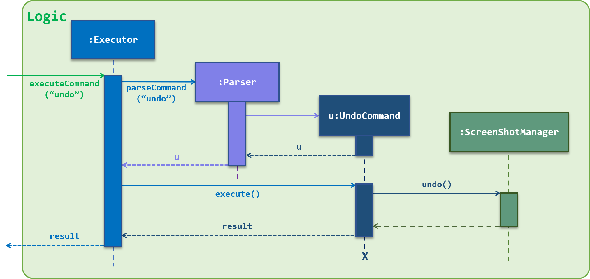  
<span style="color: green"><small><i>Figure <b>Undo Command Sequence Diagram</b></i></small></span>    
<br>

[Back To Top](#table-of-contents)    
<br>  

#### **Design Considerations**     
<b>Number of undos allowed</b>  
- <b>Alternative 1</b>: User can undo only once   
	- <b>Pros</b>: Easy to implement, only need to keep track of the state before the <i>change</i>. As such, it also requires less memory to save.   
	- <b>Cons</b>: May not be feasible as there may be instances when the user may want to undo more than once.  
- <b>Alternative 2</b>: User can undo only a fixed number of times
	- <b>Pros</b>: Allows user to undo more than once. Also, does not incur much memory either as a fixed number of states is saved only.
	- <b>Cons</b>: Need to implement measures and checks for the stacks to ensure they do not exceed the limit, and what to do when it does. User may still request to undo more than the fixed number of times.     
- <b>Alternative 3</b>: User can undo any number of times <b>(current implementation)</b>   
	- <b>Pros</b>: Allows user the freedom to undo any number of times <i>(until the initial state, of course)</i>.   
	- <b>Cons</b>: May require more memory to save the many number of states, although it may not be very significant considering the data size of each state tend to be very small (states are saved as a String).   
<br>   

<b>How undo and redo executes</b>  
- <b>Alternative 1</b>: Saves the state of the entire <i>directory list</i> <b>(current implementation)</b>           
	- <b>Pros</b>: Easy to implement, can reuse the <code>saveList()</code> and <code>loadList()</code> methods in the <code>StorageManager</code> class.
	- <b>Cons</b>: Uses unnecessary memory as the state of the entire <i>list</i> is saved each time, even though only a small <i>change</i> is made.       
- <b>Alternative 2</b>: Individual commands has an <code>undo</code> method, which is able to undo the changes they made.
	- <b>Pros</b>: Uses less memory since the command will only have to record the specific <i>change</i>.
	- <b>Cons</b>: Need to ensure correct implementation of the <code>undo</code> method, and consider scenarios if the command fails to execute.

[Back To Top](#table-of-contents)    
<br><br>


## **Appendix**  

### **Product Scope**  

#### Target user profile:

- is a NUS student
- has a need to manage a significant number of academic tasks efficiently and tidily
- willing to keep track of their academic tasks by recording them using an application program
- prefer desktop apps over other types, and reasonably comfortable with the command line interface
- able to type fast and prefers typing over mouse input

**Value proposition:** manage tasks faster and with greater efficiency than a typical GUI based task manager application which designed specifically for NUS students to manage academic tasks.

[Back To Top](#table-of-contents)    
<br>  

### **User Stories**  

Priorities: High (must have) - `* * *`, Medium (nice to have) - `* *`, Low (unlikely to have) - `*`

|Priority |As a ... |I want to ... |So that I can...|
|---|---|---|---|
|`* * *` |new user |see usage instructions |learn about existing features and how can I use them |
|`* * *` |student |add modules\tasks |have track on tasks of different modules |
|`* * *` |student |delete modules\tasks |remove modules and tasks I do not need to keep on track anymore |
|`* * *` |student |count my total tasks |keep track of how many tasks I have left and plan my time better |
|`* * *` |student |add different priorities to tasks |manage my time and do the most important things first |
|`* * *` |student |edit modules and tasks |correct or change some attributes |
|`* * *` |student |constantly check the deadline of tasks in ascending order |get tasks done on time |
|`* * *` |student |receive a reminder of urgent tasks |know which tasks should be done first |
|`* * *` |student |sort my tasks in terms of certain criteria |view my tasks of highest priorities |
|`* * *` |student |add tags to tasks | filter and view tasks with respect to certain tags           |
|`* *` |student |receive a reminder of expired tasks |know I passed the deadline |
|`* *` |student |receive a reminder of tasks which are near the deadline |never forget to finish them on time. |
|`* *` |student |attach files to tasks |open the files from the program when I start on the tasks |
|`* *` |student |organize my files according modules and tasks |enjoy the ease of picking out relevant files |
|`* *` |student |filter tasks with certain criteria |easily view what is relevant at the moment |
|`* *` |student |enter shorter commands |save my time |
|`*` |student |get the files that will be covered one week ahead |prepare(print) them on weekends |
|`*` |student |add any custom modules |not restricted to a specific category of task |

[Back To Top](#table-of-contents)    
<br>  

### **Non-Functional Requirements**  
1. Should work on any [mainstream OS](#mainstream-os) as long as it has Java `11` or above installed.
2. User with above [average typing speed](#average-typing-speed) for English text (not coding) should be able to utilize the product to manage tasks more efficiently compared to using a mouse.
3. Data entered by the user should be able to saved and carried forward for the next time usage.
4. The file containing the saved data should be portable so that the user can transfer to the other machine with any [mainstream OS](#mainstream-os) and continuing using the app without any additional configuration.
5. The product should be able to run without any noticeable sluggishness in performance for typical usage when dealing with up to 100 academic tasks.
6. The product should never crash and able to handle any input from the user.
7. Should work on both 32-bit and 64-bit environments.
8. Should not exceed 30MB in size given normal usage.

[Back To Top](#table-of-contents)    
<br>  

### **Glossary**  
##### mainstream OS
​    Windows, Linux, Unix, OS-X
##### average typing speed
​    40 words per minute


[Back To Top](#table-of-contents)    
<br>  

### **Instructions for Manual Testing**  
Given below are instructions to test the app manually.
<div class="alert alert-warning">  
<i class="fa fa-exclamation"></i> <b>Note</b> <br>   
These instructions only provide a starting point for testers to work on; testers are expected to do more <em>exploratory</em> testing. We also recommand testers to have a stable Internet connection when carrying out the testing so that the application can successfully retrieve the module information from <a href = "https://api.nusmods.com/v2/">NUSMods API</a>
</div>

#### 1. Launch and Shutdown

1. Initial launch
   1. Download the jar file from the [release page](https://github.com/AY1920S2-CS2113T-T13-2/tp/releases) and copy into an empty folder.
   2. Launch a terminal and navigate the to folder containing the jar file
   3. Run the jar file by entering command `java -jar Nuke.jar`  and hit enter(replace `Nuke.jar` by the actual file name you downloaded from the [release page](https://github.com/AY1920S2-CS2113T-T13-2/tp/releases))
   4. Expected output: **Nuke** startup screen and welcome message is displayed
2. Shut down of application
   1. Enter command `bye` and hit enter
   2. Expected output: **Nuke** program terminates with farewell message displayed.

#### 2. Add Command
<div class="alert alert-warning">  
<i class="fa fa-exclamation"></i> <b>Note</b> <br>   
All the Add Commands below are assumed to be executed at the root directory.
</div>

1. Add modules
   1. Correct usage:
      1. Test case: `addm cs2113t`
      2. Expected: the program will prompt the user with message: `SUCCESS!! Module CS2113T Software Engineering & Object-Oriented Programming is added.`
   2. Wrong usage:
      1. Test case: `addm cs1111`
      2. Expected: the program will prompt the user with message: `Sorry, the module is not provided by NUS currently.`
      3. Test case: `addm cs2113t` **after** executing `addm cs2113t` 
      4. Expected: the program will prompt the user with message: `Sorry, the module already exists.`
2. Add category
   1. Correct usage:
      1. Test case: `addc Project -m cs2113t` **after** adding `cs2113t` as *module*
      2. Expected: the program will prompt the user with message: `SUCCESS!! Category Project is created.`
   2. Wrong usage:
      1. Test case: `addc Tutorial -m cs2113t` **after** adding `cs2113t` as *module*
      2. Expected: the program will prompt the user with message: `Sorry, the category already exists.`
      3. Test case: `addc Project -m cs3235` **without** adding `cs3235` as *module*
      4. Expected: the program will prompt the user with message `Sorry, the module is not found.`
3. Add task
   1. Correct usage:
      1. Test case: `addt assignment2 -m cs2113t -c Assignment -d tmr 23:59 -p 15` **after** adding `cs2113t` as *module*
      2. Expected: the program will prompt the user with message: `SUCCESS!! Task assignment2 is created.`
   2. Wrong usage:
      1. Test case: `addt assignment2` 
      2. Expected: the program will prompt the use with message: `Sorry, unable to execute the command at the current directory level. Either move to the appropriate directory level, or enter the full directory path.`
      3. Test case: `addt testingaveryveryveryveryverylongstring -m cs2113t -c Assignment -d tmr 23:59 -p 15` **after** adding `cs2113t` as *module*
      4. Expected: the program will prompt the user with message: `Sorry, the task description cannot exceed 25 characters.`
4. Add file
   1. Correct usage:
      1. Test case: `addf test.pdf -m cs2113t -c Assignment -t assignment2 -f c:\users\null\downloads\assignment2.pdf` **after** adding an `assignment2` *task* under `Assignment` *category* and `cs2113t` *module*, assuming `c:\users\null\downloads\assignment2.pdf` exists.
      2. Expected: the program will prompt the user with message: `SUCCESS!! File test.pdf is added.`
   2. Wrong usage:
      1. Test case: `addf test.pdf -m cs2113t -c Assignment -t non-exist-task -f c:\users\null\downloads\assignment2.pdf` **without** adding the respective *task*
      2. Expected: the program will prompt the user with message: `Sorry, the task is not found.`
5. Add tag

   1. Correct usage:
      1. Test case: `addg urgent -m cs2113t -c Assignment -t assignment2` **after** adding an `assignment2` *task* under `Assignment` *category* and `cs2113t` *module*
      2. Expected: the program will prompt the user with message: `SUCCESS!! Tag urgent is added.`
   2. Wrong usage:

      1. Test case: `addg urgent -m cs2113t -c Assignment -t non-exist-task`
      2. Expected: the program will prompt the user with message: `Sorry, the task is not found.`

#### 3. Delete Command

<div class="alert alert-warning">  
<i class="fa fa-exclamation"></i> <b>Note</b> <br>   
All the Delete Commands below are assumed to be executed at the root directory.<br> And user has <b>only</b> added a <i>module</i> <code>cs2113t</code>, a <i>task</i> called <code>assignment2</code> under the <i>category</i> <code>Assignment</code>, with a <i>file</i> called <code>test.pdf</code>, with a <i>tag</i> <code>urgent</code>
</div>
1. Delete modules
   1. Correct usage:
      1. Test case: `delm cs2113t`
      2. Expected: the program will prompt the user with message: `Confirm delete CS2113T Software Engineering & Object-Oriented Programming?` and user enter `y` and hit enter, the program will prompt the user with message: `SUCCESS!! Module(s) have been deleted.`
   2. Wrong usage:
      1. Test case: `delm cs1111`
      2. Expected: the program will prompt the user with message: `Sorry. No modules found.`
   
2. Delete category
   1. Correct usage:
      1. Test case: `delc Assignment -m cs2113t` 
      2. Expected: the program will prompt the user with message: `Confirm delete Assignment?` and user enter `y` and hit enter, the program will prompt the user with message: `SUCCESS!! Category(s) have been deleted.`
   2. Wrong usage:
      1. Test case: `delc Project -m cs2113t` 
      2. Expected: the program will prompt the user with message: `Sorry. No categories found.`
   
3. Delete task
   1. Correct usage:
      1. Test case: `delt assignment2 -m cs2113t -c Assignment` 
      2. Expected: the program will prompt the user with message: `Confirm delete assignment2?` and user enter `y` and hit enter, the program will prompt the user with message: `SUCCESS!! Task(s) have been deleted.`
   2. Wrong usage:
      1. Test case: `delt non-exist-task` 
      2. Expected: the program will prompt the use with message: `Sorry. No tasks found.`
   
4. Delete file
   1. Correct usage:
      1. Test case: `delf test.pdf -m cs2113t -c Assignment -t assignment2`
      2. Expected: the program will prompt the user with message: `Confirm delete test.pdf?` and user enter `y` and hit enter, the program will prompt the user with message: `SUCCESS!! Files(s) have been deleted.`
   2. Wrong usage:
      1. Test case: `delf non-exist.pdf -m cs2113t -c Assignment -t assignment2` 
      2. Expected: the program will prompt the user with message: `Sorry. No files found.`
   
5. Delete tag
   1. Correct usage: 
      1. Test case: `delg urgent -m cs2113t -c Assignment -t assignment2`
      2. Expected: the program will prompt the user with message: `Confirm delete tag urgent of the task assignment2?` and user enter `y` and hit enter, the program will prompt the user with message: `SUCCESS!! Tag(s) have been deleted.`
   2. Wrong usage:
      1. Test case: `delg non-exist-tag -m cs2113t -c Assignment -t assignment2` 
      2. Expected: the program will prompt the user with message: `Sorry. No tasks with the tag found.`

#### 4. List Command
<div class="alert alert-warning">  
<i class="fa fa-exclamation"></i> <b>Note</b> <br>   
All the List Commands below are assumed to be executed at the root directory.<br> And user has <b>only</b> added a <i>module</i> <code>cs2113t</code>, a <i>task</i> called <code>assignment2</code> under the <i>category</i> <code>Assignment</code>, with a <i>file</i> called <code>test.pdf</code>, with a <i>tag</i> <code>urgent</code>
</div>

1. List modules

   1. Test case: `lsm`

   2. Expected: the program display a table containing all the *modules* added by the user as shown below:

      

2. List categories

   1. Test case: `lsc -m cs2113t`

   2. Expected: the program display a table containing all the *categories* under *module* `cs2113t` as shown below:

      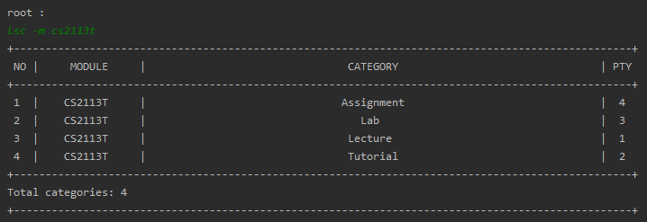

3. List tasks

   1. Test case: `lst -m cs2113t -c Assignment`

   2. Expected: the program display a table containing all the *tasks* under *module* `cs2113t` and *category* `Assignment` added by the user as shown below:

      

4. List files

   1. Test case: `lsf -m cs2113t -c Assignment -t assignment2`

   2. Expected: the program display a table containing all the files of the *task* `assignment2` under *module* `cs2113t` and *category* `Assignment` added by the user as shown below:

      
   
5. List tags

   1. Test case: `lsg -m cs2113t -c Assignment -t assignment2`

   2. Expected: the program display a table containing all the tags of the *task* `assignment2` under *module* `cs2113t` and *category* `Assignment` added by the user as shown below:

      

#### 5. Edit Command
<div class="alert alert-warning">  
<i class="fa fa-exclamation"></i> <b>Note</b> <br>   
All the List Commands below are assumed to be executed at the root directory.<br> And user has <b>only</b> added a <i>module</i> <code>cs2113t</code>, a <i>task</i> called <code>assignment2</code> under the <i>category</i> <code>Assignment</code>, with a <i>file</i> called <code>test.pdf</code>
</div>
1. Edit module
   1. Test case: `edm cs2113t -m cs2113t`
   2. Expected: the program will prompt the user with message: `SUCCESS!! The module has been updated.`
2. Edit category
   1. Test case: `edc Lab -m cs2113t -c Project`
   2. Expected: the program will prompt the user with message: `SUCCESS!! The category has been updated.`
3. Edit task
   1. Test case: `edt assignment2 -m cs2113t -c Assignment -t assignment3 -d tmr 12:00 -p 18`
   2. Expected: the program will prompt the user with message: `SUCCESS!! The task has been updated.`
4. Edit file
   1. Test case: `edf test.pdf -m cs2113t -c Assignment -t assignment2 -f test1.pdf`
   2. Expected: the program will prompt the user with message: `SUCCESS!! The file has been updated.`

#### 6. Undo and Redo Command
<div class="alert alert-warning">  
<i class="fa fa-exclamation"></i> <b>Note</b> <br>   
All the Undo and Redo Commands below are assumed to be executed at the root directory.<br> And user has <b>not</b> added any data beforehand.
</div>
1. Correct Usage:
   1. Test case: enter `addm cs2113t` followed by `undo`
   2. Expected: the program will prompt the user with message: `SUCCESS!! Data has been reverted to the previous state.`
   3. Test case: enter `addm cs2113t` followed by `undo` and then followed by `redo`
   4. Expected: the program will prompt the user with message: `SUCCESS!! Data has been reverted back to the next state.`
2. Wrong Usage:
   1. Test case: enter `addm cs2113t` followed by `undo` and another `undo`
   2. Expected: the program will prompt the user with message: `You are already at the initial state!`
   3. Test case: enter `redo` **without** executing any `undo` command
   4. Expected: the program will prompt the user with message: `You are already at the newest state!`

#### 7. Change Directory Command
<div class="alert alert-warning">  
<i class="fa fa-exclamation"></i> <b>Note</b> <br>   
All the Undo and Redo Commands below are assumed to be executed at the root directory.<br> And user has added a <i>module</i> <code>cs2113t</code>
</div>

1. Correct Usage:
   1. Test case: enter `cd cs2113t`
   2. Expected: the program prompt will be changed to `root / CS2113T :` from `root :`
2. Wrong Usage:
   1. Test case: enter `cd ..`
   2. Expected: the program prompt the user with message: `Unable to traverse further.`

#### 8. Info Command
<div class="alert alert-warning">  
<i class="fa fa-exclamation"></i> <b>Note</b> <br>   
For Info Command below are assumed to be executed at the root directory.<br> And user has added a <i>module</i> <code>cs2113t</code>
</div>

1. Test case: enter `info`

2. Expected: the program will display the information about the current *directory* to the user as shown below:

   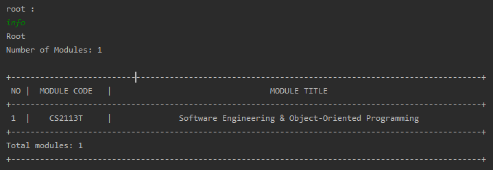

#### 9. Open File Command
<div class="alert alert-warning">  
<i class="fa fa-exclamation"></i> <b>Note</b> <br>   
All the List Commands below are assumed to be executed at the root directory.<br> And user has <b>only</b> added a <i>module</i> <code>cs2113t</code>, a <i>task</i> called <code>assignment2</code> under the <i>category</i> <code>Assignment</code>, with a <i>file</i> called <code>test.pdf</code>
</div>
1. Test case: enter `open test.pdf -m cs2113t -c Assignment -t assignment2`
2. Expected: `test.pdf` will be opened automatically using the default pdf application.

[Back To Top](#table-of-contents)    
<br>  
