<head>  
    <meta charset="UTF-8">  
    <title>Nuke User Guide v2.1</title>  
    <link href="//maxcdn.bootstrapcdn.com/font-awesome/4.2.0/css/font-awesome.min.css" rel="stylesheet"> </head>  
  
<style type="text/css">  
div {  
   text-align: justify;  
}  
.alert {  
  padding: 15px;  
  margin-bottom: 20px;  
  border: 1px solid transparent;  
  border-radius: 4px;  
}  
.alert-success {  
  background-color: #dff0d8;  
  border-color: #d6e9c6;  
  color: #3c763d;  
}  
  
.alert-info {  
  background-color: #d9edf7;  
  border-color: #bce8f1;  
  color: #31708f;  
}  
  
.alert-warning {  
  background-color: #fcf8e3;  
  border-color: #faebcc;  
  color: #8a6d3b;  
}  
  
.alert-error {  
  background-color: #f2dede;  
  border-color: #ebccd1;  
  color: #a94442;  
}  

.image-right {
  display: block;
  margin-left: 10px;
  margin-right: auto;
  float: right;
}

.image-left {
  display: block;
  margin-left: auto;
  margin-right: 10px;
  margin-bottom: 10px;
  float: left;
}

.step {
  width: 45px;
}
</style>


# **Nuke Developer Guide** <small>v2.1</small>  

By: `CS2113T-T13-2`      Since: `Feb 2020`    
<small>[Go to Webpage](https://ay1920s2-cs2113t-t13-2.github.io/tp/DeveloperGuide.html)</small>


## **Table of Contents**  

<big style="color: green">**Introduction** [&#10149;](#introduction)  </big>  
&nbsp; &nbsp; &nbsp; &nbsp; &#8226; Purpose [&#10149;](#purpose)   
&nbsp; &nbsp; &nbsp; &nbsp; &#8226; Scope [&#10149;](#scope)   
&nbsp; &nbsp; &nbsp; &nbsp; &#8226; Design Goals [&#10149;](#design-goals)   
&nbsp; &nbsp; &nbsp; &nbsp; &#8226; Definitions [&#10149;](#definitions)    
<br>   
<big style="color: green"> **Setting Up** [&#10149;](#setting-up)  </big>  
<br>  
<big style="color: green">  **Architecture** [&#10149;](#architecture)  </big>  
<br>    
<big style="color: green">  **Structure Implementation** [&#10149;](#structure-implementation)  </big>   
&nbsp; &nbsp; &nbsp; &nbsp; &#8226; Directory [&#10149;](#1-directory)    
&nbsp; &nbsp; &nbsp; &nbsp; &#8226; Directory Manager [&#10149;](#2-directory-manager)    
&nbsp; &nbsp; &nbsp; &nbsp; &#8226; Directory Traversal [&#10149;](#3-directory-traversal)    
<br>   
<big style="color: green"> **Command Implementation** [&#10149;](#command-implementation)  </big>  
&nbsp; &nbsp; &nbsp; &nbsp; 1. Add Command [&#10149;](#1-add-command)    
&nbsp; &nbsp; &nbsp; &nbsp; 2. List Command [&#10149;](#2-list-command)     
&nbsp; &nbsp; &nbsp; &nbsp; 3. Delete Command [&#10149;](#3-delete-command)     
&nbsp; &nbsp; &nbsp; &nbsp; 4. Edit Command [&#10149;](#4-edit-command)    
&nbsp; &nbsp; &nbsp; &nbsp; 5. Change Directory Command [&#10149;](#5-change-directory-command)    
&nbsp; &nbsp; &nbsp; &nbsp; 6. Open File Command [&#10149;](#6-open-file-command)    
&nbsp; &nbsp; &nbsp; &nbsp; 7. Info Command [&#10149;](#-info-command)    
&nbsp; &nbsp; &nbsp; &nbsp; 8. Undo and Redo Commands [&#10149;](#8-undo-and-redo-commands)    
<br>   
<big style="color: green"> **Storage Implementation** [&#10149;](#storage-implementation)</big>     
<br>   
<big style="color: green"> **Appendix** [&#10149;](#appendix)  </big>  
&nbsp; &nbsp; &nbsp; &nbsp; &#8226; User Stories [&#10149;](#user-stories)   
&nbsp; &nbsp; &nbsp; &nbsp; &#8226; Non-Functional Requirements [&#10149;](#non-functional-requirements)   
&nbsp; &nbsp; &nbsp; &nbsp; &#8226; Glossary [&#10149;](#glossary)   
&nbsp; &nbsp; &nbsp; &nbsp; &#8226; Manual Testing [&#10149;](#manual-testing)    

<br>   

## **Introduction**  

### **Purpose**  
<span style="text-align: justify; display: block">
This document describes the structure and software design decisions for the <b>Nuke</b> application. The <b>Nuke</b> application is a simple yet powerful task management application that is dedicated to providing <b>NUS students</b> a more efficient way to organise their <i>modules</i> and <i>tasks</i>.  
</span>
    

### **Scope**  
<span style="text-align: justify; display: block">
This document will cover the structure and software design decisions for the implementation of <b>Nuke</b>. The intended audience for this document are developers, designers and software testers of <b>Nuke</b> <i>or</i> other similar task management application.
</span>  

### **Design Goals**  

```
	// To be done.
```

[Back To Top](#table-of-contents)    
<br>  

### **Definitions**  
```
	// To be done.
```


[Back To Top](#table-of-contents)    
<br>  

## **Setting Up**  
Refer to the guide [here](#) to set up.  

[Back To Top](#table-of-contents)    
<br>  

## **Design**  


[Back To Top](#table-of-contents)    
<br>  
<br>

## **Command Implementation**  
This section will describe the significant details of how the commands in <b>Nuke</b> are being implemented.  

### 1. Add Command
#### Overview
The **add** feature adds modules, categories, tasks and tags into the Module, Category and Task List respectively.

#### 1.1. Add module feature

The add module feature enable the user to add modules into the Module List.

When the user first requests to execute the `addm` command(*assuming the command format given is valid*) to add a module by providing its name, the application will parse the input after `addm`  command word as the module code. From here, there are **three** possible outcomes:

1. The module specified by the user is not provided by NUS -- No module will added.
2. The module specified by the user is already added -- No module will be added.
3. The module specified by the user is provided by NUS and have not been added -- Module will be added.

#### Feature Implementation

This feature is facilitated by the `AddModuleCommand` class which add the modules specified by the user. It overrides the `execute()` method which extends from the abstract `AddCommand` class which extends from the abstract `Command` class.   The `execute()` method's role is to execute the adding module operation and do necessary checks .

The `AddCommand` will first try to call the static method `add` in `ModuleManager`  class, which will try to add the module specified by the user, exception will thrown according the following rules:

1. `DuplicateModuleException` will be thrown if the module specified by the user is contained in the `ArrayList` named `moduleList` in `ModuleManager` class.
2. `ModuleNotProvidedException` will be thrown if the module code specified by the user is not contained in the `HashMap` named `modulesMap` in `ModuleManager` class.

Below are the class-diagram for the involved classes:

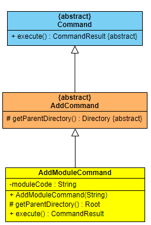

<span style="color: green"><small><i>Figure <b>Add Module Command Class Diagram</b></i></small></span>

#### Example Usage

The addition of modules will be illustrated as follows.

James is a user and wants to add the module with the module code of "CS3235". Assume that he has the current modules:

```
+--------------------------------------------------------------------------------------------------+
 NO |  MODULE CODE   |                                 MODULE TITLE
+--------------------------------------------------------------------------------------------------+
 1  |     CS1231     |                             Discrete Structures
 2  |     CS2100     |                            Computer Organisation
 3  |     CS2113     |              Software Engineering & Object-Oriented Programming
+--------------------------------------------------------------------------------------------------+
Total modules: 3
+--------------------------------------------------------------------------------------------------+
```

1. James will simply enter the command `addm cs3235`

   After the input is parsed as an **add module task** and executed, the `AddModuleCommand#execute()` will call `ModuleManager#add()` to add the module cs3235. In the `ModuleManager#add()` method, it will call `ModuleManager#contains()` to check if the module cs3235 exists in the `ArrayList` named `moduleList` , then it will check if the module code "cs3235" is a key in the `HashMap` named `modulesMap`, after all, it will instantiate an `Module` object with the module code "CS3235" and respective title "Computer Security", then add the object into the `moduleList`.

2. James receive the following feedback:
```
   root :
   addm cs3235
   SUCCESS!! Module CS3235 Computer Security has been added.
   
   root :
   lsm
   Here are what you are looking for...
   
   +--------------------------------------------------------------------------------------------------+
    NO |  MODULE CODE   |                                 MODULE TITLE
   +--------------------------------------------------------------------------------------------------+
    1  |     CS1231     |                             Discrete Structures
    2  |     CS2100     |                            Computer Organisation
    3  |     CS2113     |              Software Engineering & Object-Oriented Programming
    4  |     CS3235     |                              Computer Security
   +--------------------------------------------------------------------------------------------------+
   Total modules: 4
   +--------------------------------------------------------------------------------------------------+
```


Below is a *sequence diagram* to illustrate the above example scenario.  

```
	// To do Sequence diagram here
```


#### 1.2. Add Category and Task Features

Since add category and add task feature are implemented in a similar pattern, they can be explained together.

The add category/task enable the user to add category/task/tag into Category/Task/Tag List.(One to one correspondence, which means the user can only add category to Category List, task to Task List).

When the user first request to execute the **add** command*(assuming the command format given is valid)* to add a category/task by providing its name, the application will parse the input after `addm` /`addc` command word as the name for category/task. From here, there are **three** possible outcomes:

1. The specified upper parent directory does not exist. -- No category/task will be added.
2. The name of the specified category/task already exist. -- No category/task will be added.
3. The specified upper parent directory exist and the name of the specified category/task does not exist. -- The specified category/task will be added.

#### Feature Implementation

This feature is facilitated by the `AddCategoryCommand` and `AddTaskCommand` class which add the corresponding category or task respectively.

The above-stated two classes overrides the `execute()` method which extends from the abstract `AddCommand` class which extends from the abstract `Command` class. The `execute()` method's role is to execute the adding category/task operation and do necessary checks.

The `AddCategoryCommand` and `AddTaskCommand` will first call the `getParentDirectory()` method to get the parent directory, then it will instantiate a `Category`/`Task` object and try to call `add` method in their respective parent directory class to add the new object, exception will be thrown according to the following rules:

1. `ModuleNotFoundException` will be thrown if the specified module code does not exists in the `ArrayList` of Module when adding a new category or task.
2. `CategoryNotFoundException` will be thrown if the specified category name does not exists in the `ArrayList` of Category in `CategoryManager` in `Module` when adding a new task.
3. `IncorrectDirectoryLevelException` will be thrown if the user is performing the`addc`/`addt` command in the wrong directory without specifying their full parent directories.(For example, when user trying to execute `addc` in a `Root`/`Task` directory, or trying to execute `addt`  in a `Root`/`Module` directory)
4. `DuplicateTaskException`/`DuplicateCategoryException` will be thrown if the name of the category/task already exist in the current directory.

Below are the class-diagram for the involved classes:

```
to-do: add the class-diagram
```

#### Example Usage

The addition process for *category* and *task* are similar. In this example, the addition process for *category* will be illustrated as a series of steps.

James is a user and wants to add a *category* named  "misc" under the *module* cs3235. Assume that he has the current Module List and current Category List in the module cs3235:

```
root :
lsm
Here are what you are looking for...

+--------------------------------------------------------------------------------------------------+
 NO |  MODULE CODE   |                                 MODULE TITLE                       
+--------------------------------------------------------------------------------------------------+
 1  |     CS1231     |                             Discrete Structures                    
 2  |     CS2100     |                            Computer Organisation                   
 3  |     CS2113     |              Software Engineering & Object-Oriented Programming    
 4  |     CS3235     |                              Computer Security                     
+--------------------------------------------------------------------------------------------------+
Total modules: 4
+--------------------------------------------------------------------------------------------------+

root :
lsc -m cs3235
Here are what you are looking for...

+--------------------------------------------------------------------------------------------------+
 NO |     MODULE     |                                CATEGORY                                | PTY
+--------------------------------------------------------------------------------------------------+
 1  |     CS3235     |                               Assignment                               |  4
 2  |     CS3235     |                                  Lab                                   |  3
 3  |     CS3235     |                                Lecture                                 |  1
 4  |     CS3235     |                                Tutorial                                |  2
+--------------------------------------------------------------------------------------------------+
Total categories: 5
+--------------------------------------------------------------------------------------------------+
```

1. James has two choices:

   1. enter `cd cs3235` to enter the module directory then enter `addc misc` to add the category.
   2. enter `addc misc -m cs3235` to add the category at the root directory.

   Suppose James use the first method, after the second input, the input is parsed as an **add task** command and executed, the `AddCategoryCommand#execute()` will call `AddCategoryCommand#getParentDirectory()` to get the current parent directory, then it will instantiate an `Category` object with the name "misc". After which `CategoryManager#add()` will be called to add the new object. In the `CategoryManager#add()` method, it will call `CategoryManager#contains()` method to check if the current parent directory contains the category with name "misc", finally add the object into the `ArrayList` of `categoryList`.

2. James receive the following feedback:

   ```
   root :
   addc misc
   SUCCESS!! Category misc is created.
   ```


Below is a *sequence diagram* to illustrate the above example scenario.  

```
to-do: add the sequence diagram
```

<br><br>

### 2. List Command  

#### Overview  

The **List** feature lists out *modules*, *categories* and *tasks* from the Module, Category and Task List respectively.   
When the user first requests to execute the **list** command to list out directory by providing its name, the application will first filter for directories with matching names. From here, there are **three** possible outcomes:  

1. There are **no** matches --  Nothing is listed out.
2. There are matches -- The list of matches will be shown to the user.

#### Feature Implementation  

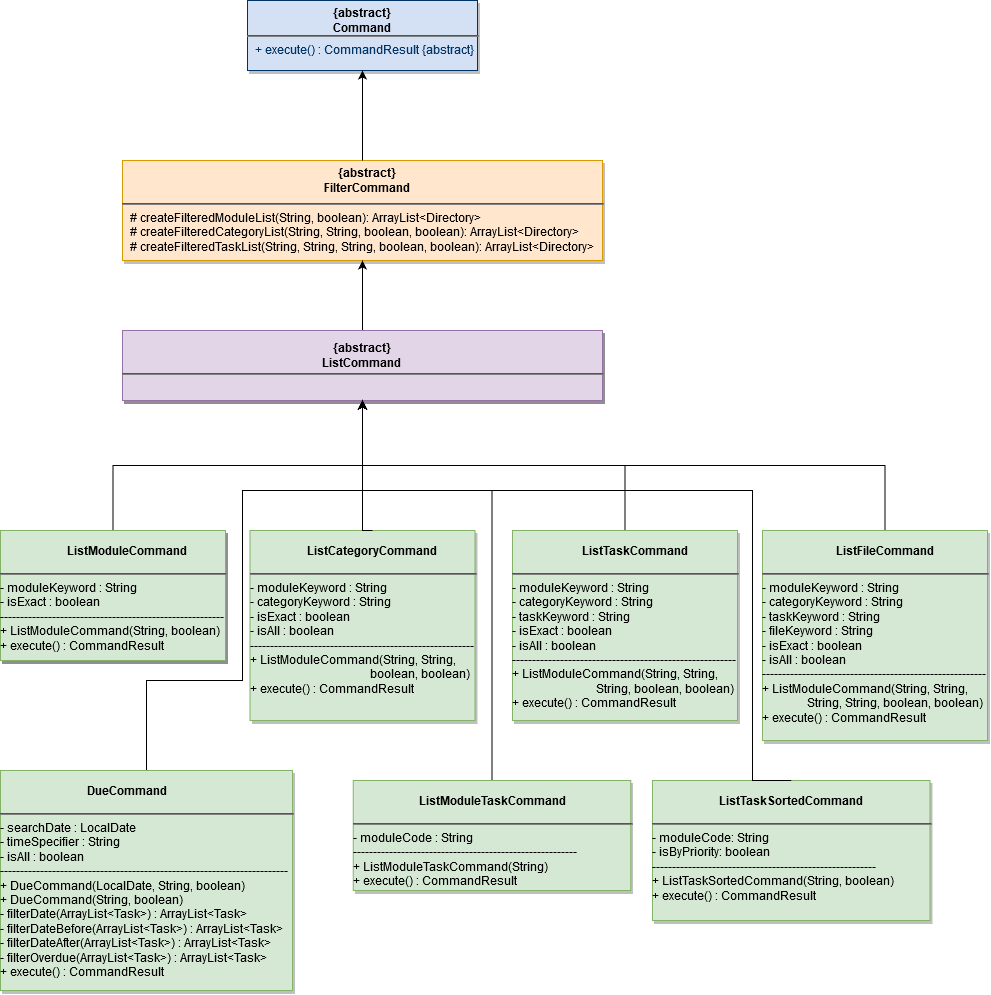

<span style="color: green"><small><i>Figure <b>List Command Class Diagram</b></i></small></span>

The `ListModuleCommand`, `ListCategoryCommand`, `ListTaskCommand`, `ListFileCommand`, `DueCommand`, `ListModuleTaskCommand`, `ListTaskSortedCommand` classes in the application facilitates this **list** feature. They are in charge of listing out *modules*, *categories*, *tasks*, *file*s, all *task*s at the specified time period, *task*s of *module* in ascending order of deadline and all undone *task*s sorted by deadline or priority respectively. <br>  

As shown in the figure above, those seven classes each extends from the abstract `ListCommand` class.  They also [override](#) the ancestor `Command` class's `execute()` method, which role is to list out desired entries to the user. <br>


The `ListCommand` class in turn extends the `FilterCommand` abstract class. The `FilterCommandClass` contains the following vital methods for filtering:  

- `createFilteredModuleList()` -- Creates an `ArrayList` of the filtered *modules*.  
- `createFilteredCategoryist()` -- Creates an `ArrayList` of the filtered *categories*.  
- `createFilteredTaskList()` -- Creates an `ArrayList`of the filtered *tasks*.  

Lastly, the `FilterCommand` class extends the abstract `Command` class that contains the `execute()` method to execute the actual **list** command.  

#### Example Usage  

The listing process for *modules*, *categories*, *tasks*, *file*s, all *task*s at the specified time period, *task*s of *module* in ascending order of deadline and all undone *task*s sorted by deadline or priority are similar. In this example, the listing process for *modules* will be illustrated as a series of steps.  <br>
James is a user and wants to list out all of his *modules* with *moduleCode* begin with "CS". Assume that he has the current Module List: 

```
+--------------------------------------------------------------------------------------------------+
 NO |  MODULE CODE   |                                 MODULE TITLE                                 
+--------------------------------------------------------------------------------------------------+
 1  |     CS2101     |             Effective Communication for Computing Professionals              
 2  |    CS2113T     |              Software Engineering & Object-Oriented Programming              
 3  |     CS3230     |                      Design and Analysis of Algorithms                       
 4  |     CS3235     |                              Computer Security                               
 5  |    GEH1036     |                           Living with Mathematics                            
 6  |    IFS4103     |                         Penetration Testing Practice                         
+--------------------------------------------------------------------------------------------------+
Total modules: 6
+--------------------------------------------------------------------------------------------------+
```

<br>
James will first enter the command to list out *modules* with *moduleCode* begin with "CS":  
	`lsm CS`  
After the input is parsed as a **list module** command and executed, the `ListModuleCommand#execute()` will call `FilterCommand#createFilteredModuleList()` to create the filtered list of *modules* containing the *Modules* with *moduleCode* begin with "CS". `ListModuleCommand#execute()` will then call its parent class's method `FilterCommand#sortModuleList(filteredModuleList)` to sort the *modules* by their respective moduleCode. And finally the sorted Arraylist of *Module*s is used to instantiate a CommandResult object and returned, and `ui#showResult(commandResult)` will be called to show the result to the user. And Listing process ends.

Below is a *sequence diagram* to illustrate the above example scenario.  

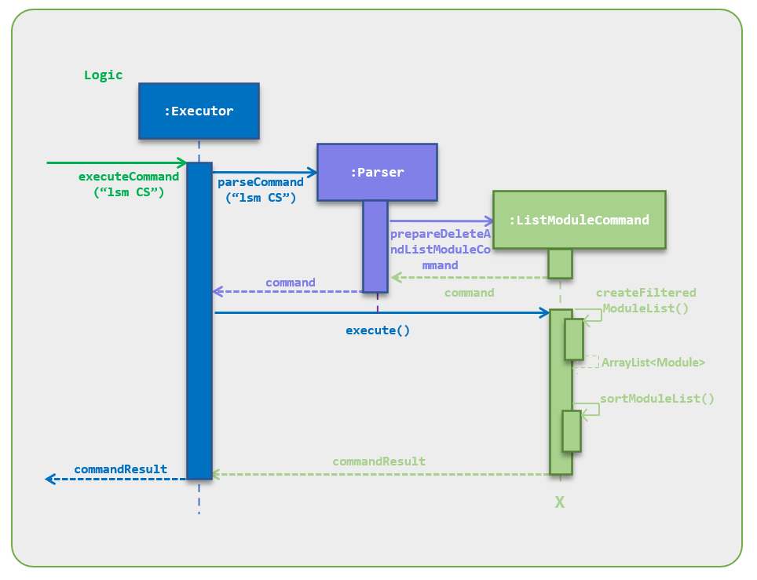

<br><br>

### 3. Delete Command  
#### Overview  
The **delete** feature deletes *modules*, *categories* and *tasks* from the Module, Category and Task List respectively.   
When the user first requests to execute the **delete** command to delete a directory by providing its name, the application will first filter for directories with matching names. From here, there are **three** possible outcomes:  

1. There are **no** matches --  Nothing is deleted.
2. There is **one** match -- A prompt will be given to the user to confirm the deletion.
3. There are **multiple** matches -- The list of matches will be shown to the user, and the user chooses which ones to delete. A further prompt will be given to confirm the deletion(s).

#### Feature Implementation  
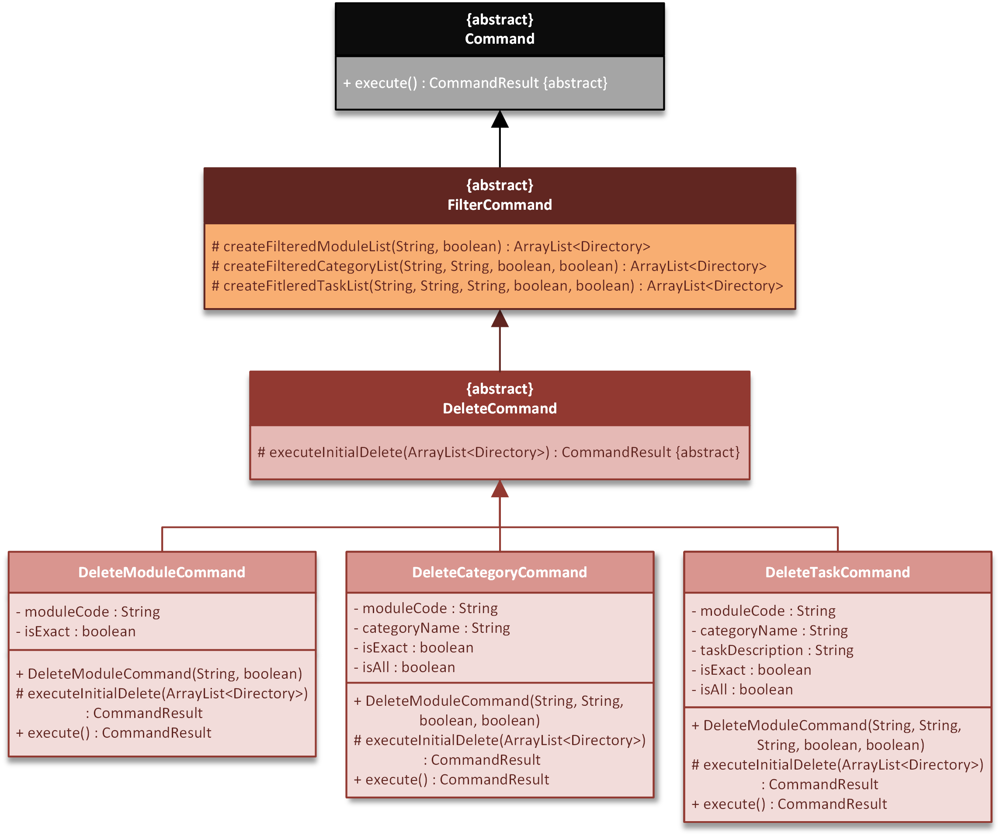
<span style="color: green"><small><i>Figure <b>Delete Command Class Diagram</b></i></small></span>

<br>

The `DeleteModuleCommand`, `DeleteCategoryCommand` and `DeleteTaskCommand` classes in the application facilitates this **delete** feature. They are in charge of deleting *modules*, *categories* and *tasks* respectively. <br>  

As shown in the figure above, those three classes each extends from the abstract `DeleteCommand` class.  They also [override](#) the `DeleteCommand` class's `executeInitialDelete()` method, which role is to prepare the necessary messages or prompts for the user depending on the number of filtered matches. <br>  

The `DeleteCommand` class in turn extends the `FilterCommand` abstract class. The `FilterCommandClass` contains the following vital methods for filtering:  
- `createFilteredModuleList()` -- Creates an `ArrayList` of the filtered *modules*.  
- `createFilteredCategoryist()` -- Creates an `ArrayList` of the filtered *categories*.  
- `createFilteredTaskList()` -- Creates an `ArrayList`of the filtered *tasks*.  

Lastly, the `FilterCommand` class extends the abstract `Command` class that contains the `execute()` method to execute the actual **delete** command.  
<br>  

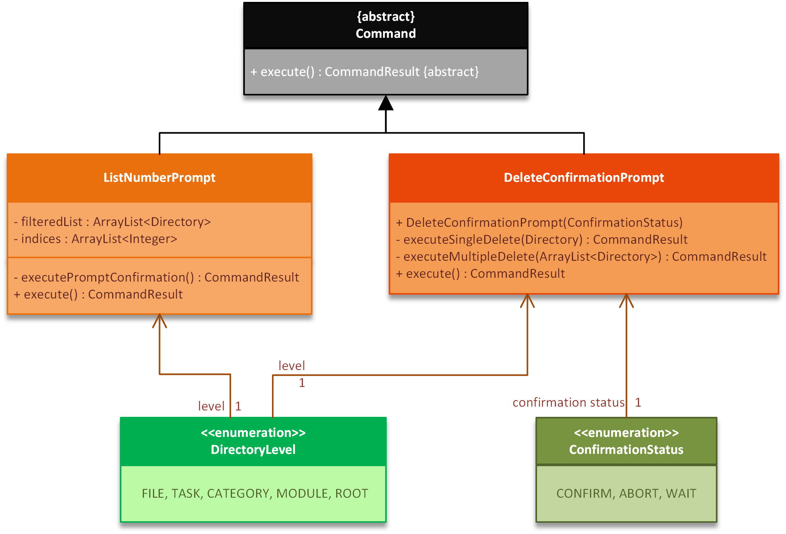
<span style="color: green"><small><i>Figure <b>Prompt Command Class Diagram</b></i></small></span>

<br> 

Other than the commands, two prompts are involved.   
The prompt to request for the list number(s) of the item(s) to delete from the filtered list is managed by the `ListNumberPrompt` class. The prompt to request to confirm the deletion is managed by the `DeleteConfirmationPrompt` class.  
<br>


#### Example Usage  
The deletion process for *modules*, *categories* and *tasks* are similar. In this example, the deletion process for *tasks* will be illustrated as a series of steps.  <br>
James is a user and wants to delete some of his *tasks* with *description* "work". Assume that he has the current Task List:  

```
+--------------------------------------------------------------------------------------------------+
 NO |  MODULE  |       CATEGORY       |          TASK          |           DEADLINE           | PTY 
+--------------------------------------------------------------------------------------------------+
 1  |  CS1231  |      Assignment      |       group work       |      28/03/2020 06:00PM      | 20  
 2  |  CS1231  |       Tutorial       |       Tutorial 6       | 24/03/2020 11:59PM [OVER!!]  |  6  
 3  |  CS2100  |       Lecture        |     watch webcast      |            -NIL-             |  1  
 4  |  CS2113  |      Bigger Lab      |      Big Lab Work      |        today 06:00PM         |  7  
 5  |  CS2113  |       Tutorial       | tutorial worksheet 10  |        today 12:00PM         |  5  
+--------------------------------------------------------------------------------------------------+
Total tasks: 5
+--------------------------------------------------------------------------------------------------+
```

{: .image-left .step }   
<br>
James will first enter the command to delete *tasks*:  
	`delt work -a`  
	After the input is parsed as a **delete task** command and executed, the `DeleteTaskCommand#execute()` will call `FilterCommand#createFilteredTaskList()` to create the filtered list of *tasks* containing the *description* "work". `DeleteTaskCommand#execute()` will then call its own method `DeleteTaskCommand#executeInitialDelete(filteredList)` to prepare the prompt to request James to enter the list number of the *tasks* he would like to delete.  

{: .image-left .step }    
<br>
James receives the following prompt:

```  
Multiple matching tasks found.
+--------------------------------------------------------------------------------------------------+
 NO |  MODULE  |       CATEGORY       |          TASK          |           DEADLINE           | PTY 
+--------------------------------------------------------------------------------------------------+
 1  |  CS1231  |      Assignment      |       group work       |      28/03/2020 06:00PM      | 20  
 2  |  CS2113  |      Bigger Lab      |      Big Lab Work      |        today 06:00PM         |  7  
 3  |  CS2113  |       Tutorial       | tutorial worksheet 10  |        today 12:00PM         |  5  
+--------------------------------------------------------------------------------------------------+
Total tasks: 3
+--------------------------------------------------------------------------------------------------+

Enter the list number(s) of the tasks to delete.
```

He proceeds to enter list numbers `2 3` as he has already completed both *tasks*.  
After the list numbers are parsed, it will call `ListNumberPrompt#execute()`, which will prepare the prompt for the delete confirmation, and then calls `ListNumberPrompt#executePromptConfirmation()`.

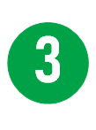{: .image-left .step}   
<br>
James receives another prompt:  

```  
Confirm delete these tasks?
tutorial worksheet 10
Big Lab Work
```

He enters `y` to confirm the deletion.
`DeleteConfirmationPrompt#execute()` will be called, which then calls `DeleteConfirmationPrompt#executeMultipleDelete(filteredList)` to delete James' selected *tasks* from his Task List.

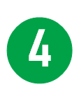{: .image-left .step}  
<br>
James receives the final message:

```
SUCCESS!! Task(s) have been deleted.
```

Deletion process ends.  

<br>

Below is a *sequence diagram* to illustrate the above example scenario.  

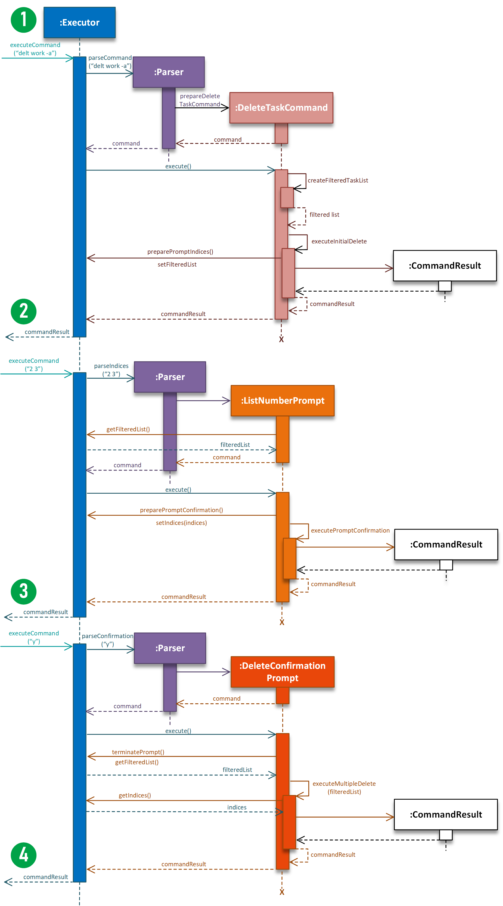
<span style="color: green"><small><i>Figure <b>Delete Command Sequence Diagram</b></i></small></span>    

<br><br>

### **4. Edit Command**
<div>   
The <b>edit</b> command edits the attributes of a <i>directory</i>. For example, user can edit a <i>category</i>'s <i>name</i> and <i>priority</i>. For <i>tasks</i>, the user is also able to mark them as done.   
</div>    
  
#### **Implementation**     
<br>

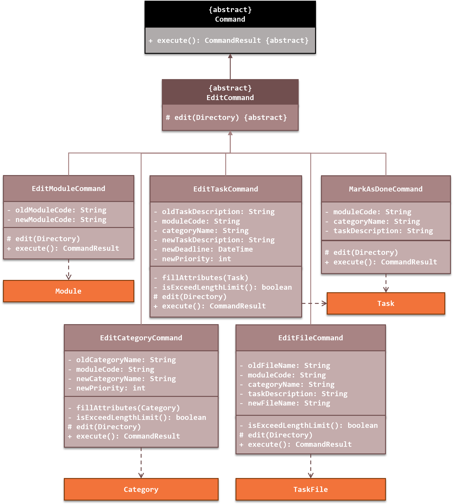   
 <span style="color: green"><small><i>Figure <b>Edit Commands Class Diagram</b></i></small></span>   
 <br>  
<div>   
The <b>edit</b> commands all work in a similar manner. As seen in the <i>class diagram</i> above, each of the <b>commands</b> extends from the <i>abstract</i> <code>EditCommand</code> class. The <code>EditCommand</code> class has an <i>abstract</i> method, <code>toEdit(Directory)</code>, which is to be implemented by each of the <b>edit</b> commands. 
<br><br>
The <b>edit</b> command will first checks if the attribute String exceeds a fixed length by its own  <code>isExceedLengthLimit()</code> method <i>(See <a href="design-considerations-1">here</a> for the considerations of the length limit)</i>. It then calls <code>DirectoryTraverser</code> class to get the appropriate <code>Directory</code> to edit.    
<br><br>   
<div class="alert alert-info">  
<i class="fa fa-info"></i> <b>Info</b> <br>   
If the attribute String <b>exceeds</b> the length limit, an <b>exception</b> will be thrown &#128528; and the user will be shown an error message.  
</div>   
<br>  
In addition, for <code>EditCategoryCommand</code> and <code>EditTaskCommand</code>, it will fill in any missing attributes not specified by the user in their input. This is done through the command's <code>fillAttributes()</code> method.  
<br><br>
Finally, the <b>edit</b> command will perform the <code>edit()</code> method to edit the <code>Directory</code>. 
</div>    
   
<div class="alert alert-info">  
<i class="fa fa-info"></i> <b>Info</b> <br>   
The <code>Parser</code> class also helps to check if the user's input contains attributes of the <i>directory</i> to edit. For example, if a user executes the <b>edit module</b> command, but does not enter a <i>new module code</i> to be edited, the application will prompt the user to enter a <i>new module code</i>.  
</div>   
<br>    
   
An example <i>sequence diagram</i> is shown below when a user requests to edit a <i>category</i>:<br>
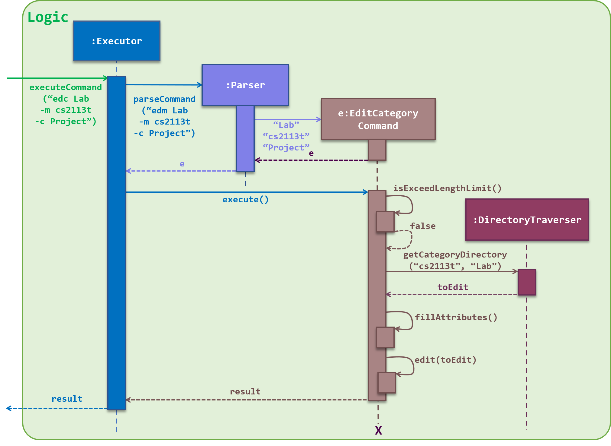    
 <span style="color: green"><small><i>Figure <b>Edit Command Sequence Diagram</b></i></small></span>   
<br>   
  
[Back To Top](#table-of-contents)    
<br>  

#### **Design Considerations**     
<b>Editing Task</b>  
- <b>Alternative 1</b>: Merge <code>EditTaskCommand</code> class with <code>MarkAsDoneCommand</code> class     
	- <b>Pros</b>: There is one less class to implement. Also, the user does not need to remember another <i>command word</i>.  
	- <b>Cons</b>: While there may be one less <i>command word</i>, there may be one more <i>prefix</i> for the user to remember as well. Also, marking a <i>task</i> as done seems to be more specific compared to changing the attributes of the <i>task</i> such as its <i>description</i> and <i>deadline</i>.   
- <b>Alternative 2</b>: Have separate <code>EditTaskCommand</code> and <code>MarkAsDoneCommand</code> classes <b>(current implementation)</b>        
	- <b>Pros</b>: Have a more specialised class just to mark user's <i>tasks</i> as done. Easier to implement and differentiates from the standard <code>EditTaskCommand</code>.      
	- <b>Cons</b>: There is one more <i>command word</i> for the user to remember.          
<br>   
  
<b>Edit Multiple Attributes</b>  
- <b>Alternative 1</b>: User can only edit one attribute of a <i>directory</i> at a time       
	- <b>Pros</b>: May be easier to implement. Checking that the user has provided an attribute to edit is also simple <i>(just check if the attribute is empty)</i>.  
	- <b>Cons</b>: The user may want to edit more than one attributes at the same time. For example, the user may want to change both the <i>name</i> and <i>priority</i> of a <i>category</i>. This means that the user will have to execute the <b>edit category</b> command twice, which is not efficient.
- <b>Alternative 2</b>: User can edit any number for attributes of a <i>directory</i> at a time <b>(current implementation)</b>        
	- <b>Pros</b>: The user does not need to keep executing the <b>edit</b> command when editing more than one attribute.    
	- <b>Cons</b>: Possibly slightly harder to implement. We now have to check if the user has provided at least one attribute to be edited. Also, we need to be able to efficiently extract the individual attributes from the user's input. However, this could be made easier by grouping and matching the attributes using <b>Java</b>'s <b>RegEx</b> patterns.           

[Back To Top](#table-of-contents)    
<br>  
<br>  

### **5. Change Directory Command**   
<div>  
The <b>change directory</b> command traverses the user up and down the <b>Directory Tree</b>, much like how the Linux Shell operates. In other words, the user enters the <i>directory name</i> to traverse to that <i>directory</i>, or <code>..</code> to traverse to the parent <i>directory</i>  
</div>   

#### **Implementation**     
<div>   
The <b>change directory</b> command uses various methods from the <code>DirectoryTraverser</code> class in its execution. <br><br>
If the user wants to traverse down to a <i>directory</i>, the <code>ChangeDirectoryCommand</code> will call <code>DirectoryTraverser#findNextDirectory(nextDirectoryName)</code> to get the <code>Directory</code> to traverse to. Then, <code>ChangeDirectoryCommand</code> will call <code>DirectoryTraverser#ftraverseDown(nextDirectory)</code> to move the user to that <i>directory</i>.<br><br>
If the user want to traverse up from the current <i>directory</i> instead, <code>ChangeDirectoryCommand</code> will call <code>DirectoryTraverser#traverseUp()</code> to bring the user back to the <i>parent directory</i>.   
</div>     <br>  
<div class="alert alert-info">  
<i class="fa fa-info"></i> <b>Info</b> <br>   
The <b>Root Directory</b> and the <b>File Directory</b> are the first and last <i>directories</i> in the <b>Directory Tree</b> respectively. If the user attempts to traverse down up the <b>Root Directory</b>, or traverse down a <b>File Directory</b>, an error message will be shown to the user instead. &#128550;
</div> <br>   

Shown below is the <i>sequence diagram</i> when a user executes the <b>change directory</b> command to traverse down to another <i>directory</i>.<br>
    
 <span style="color: green"><small><i>Figure <b>Change Directory Command Sequence Diagram</b></i></small></span>   
<br>   
 
[Back To Top](#table-of-contents)    
<br>    
   
#### **Design Considerations**     
<b>Traversal Method</b>  
- <b>Alternative 1</b>: User can only traverse one level at a time  <b>(current implementation)</b>    
	- <b>Pros</b>: Simple to implement. Only need to consider getting the direct <i>parent</i> or <i>child directory</i>.   
	- <b>Cons</b>: User may have to keep executing the <b>change directory</b> command just to reach their desired <i>directory</i>, especially if the user's current <i>directory</i> is "far" from the destination <i>directory</i>.    
- <b>Alternative 2</b>: User can traverse more than one level at a time, similar to Linux Shell.     
	- <b>Pros</b>: Saves user time from having to possibly execute the <b>change directory</b> command multiple times. User can simply enter <code>cd directory1/directory2/directory3</code> and move four <i>directory levels</i> down.      
	- <b>Cons</b>: Much harder to implement as we need to consider how the split the String into individual <i>directory names</i>. Furthermore, we have to consider the case if the provided <i>directory name</i> contains <code>/</code>, and how we will implement a method to differentiate the <code>/</code> in the <i>name</i> from a <code>/</code> in the <i>directory path</i>.      


[Back To Top](#table-of-contents)    
<br>  <br>  
  
### **6. Open File Command**    
<div>  
The <b>open file</b> command opens up the <i>file(s)</i> of a <i>task</i> specified by the user. User can choose whether to open a single <i>file</i> in the <i>task</i>, or <b>all</b> the <i>files</i> in the <i>task</i>.  
</div>   

#### **Implementation**     
<div>
The implementation of the <b>Open File</b> command uses two important <b>Java APIs</b> &ndash; <code>java.io.File</code> and <code>java.awt.Desktop</code>. The first <b>API</b> is responsible for operations involving file access, while the second <b>API</b> is used to open the file to the Desktop. <br><br>  

The <code>OpenFile</code> class first obtains the list of <i>files</i> from the <i>task</i> to open via the <code>OpenFile#getFilesToOpen()</code> method. Then, <code>OpenFile</code> executes the <code>OpenFile#openFiles()</code> method to open each of the <i>files</i> in the list. 
</div>   
<div class="alert alert-info">  
<i class="fa fa-info"></i> <b>Info</b> <br>   
If there is an error opening a particular <i>file</i> in the list &#128534;, the opening process will not be terminated immediately. Instead, the application will continue to open the rest of the <i>files</i> in the list. <br>
After it has gone through the list, it will then show the user the <i>files</i> that were not opened due to an error.
<br><br>
This is done by collecting the <i>file names</i> of the failed to open <i>files</i> into a String, and thereafter throw an <b>exception</b> with the String of </i>file names</i> as the message.
</div> <br>   
    
Below is a <i>sequence</i> diagram of how the <b>open file</b> command operates:<br>   
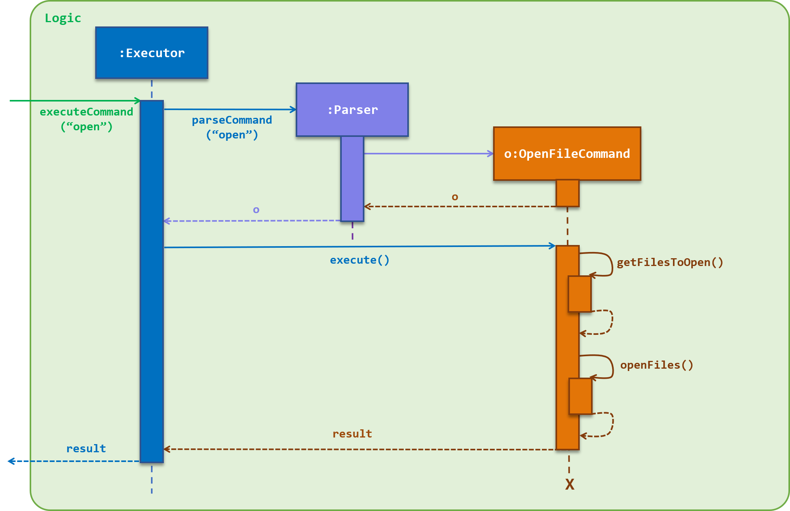    
 <span style="color: green"><small><i>Figure <b>Open File Command Sequence Diagram</b></i></small></span>   

<br>

[Back To Top](#table-of-contents)    
<br>  

#### **Design Considerations**     
<b>Allow opening of multiple files</b>  
- <b>Alternative 1</b>: User can open only one file at a time   
	- <b>Pros</b>: Simple to implement. Just search for the corresponding <b>File Directory</b>, get the <i>file path</i>, then open the real file in that <i>path</i>.    
	- <b>Cons</b>: User would usually want to open all or most of the <i>files</i> attached to the <i>task</i>. Opening each <i>file</i> one by one will reduce the ease of using the application.     
- <b>Alternative 2</b>: User can choose which <i>files</i> they want to open from a list of <i>files</i> shown to them  
	- <b>Pros</b>: User can open exactly the <i>files</i> that they require at the moment.      
	- <b>Cons</b>: Much harder to implement as we need to consider how the process to prompt the user to choose the <i>files</i> would be enforced. Thereafter, we need to check if the selection exists in the list of <i>files</i>.    
- <b>Alternative 3</b>: User can choose to open a specified <i>file</i>, or all the <i>files</i> of the <i>task</i> <b>(current implementation)</b>   
	- <b>Pros</b>: User now has a choice, and can choose the best between two options.   
	- <b>Cons</b>: User now has to close the unwanted <i>files</i> that was opened in the process, which may inconvenience the user.   

[Back To Top](#table-of-contents)    
<br>  <br>  

### **7. Info Command**    
<div>  
The <b>info</b> command shows the information of the <i>current directory</i> that the user is in. For example, when in the <b>Module</b> directory, the <b>info</b> command will show the <i>module code</i>, <i>module title</i> and the <i>module</i>'s <i>category list</i> to the user.  
</div>  

<br>

#### **Implementation**     
<div>
The implementation of this command is quite straightforward. <br>
The <code>InfoCommand</code> class will call for the <code>DirectoryTraverser</code> class to get the current <code>Directory</code>. Then, the information of the <code>Directory</code> is obtained by calling <code>Directory#toString()</code>. The <i>list</i> to show is generated by the <code>InfoCommand#getListToShow()</code> method. <br>
These information will eventually be shown to the user through the <code>Ui</code>.
</div>  

The <i>sequence</i> diagram of what happens when a user executes the <b>info</b> command is as illustrated:<br>   
    
 <span style="color: green"><small><i>Figure <b>Info Command Sequence Diagram</b></i></small></span>   
 
[Back To Top](#table-of-contents)    
<br>  <br>  

### **8. Undo and Redo Commands**    
#### **Overview**     
<div>
The <b>undo</b> and <b>redo</b> commands work hand in hand with each other. The <b>undo</b> command undoes a <i>change</i> made to the <b>Directory List</b>. <i>Change</i> here refers to adding, deleting or editing items to the <i>list</i>. The <b>redo</b> command reverts the effect of the <b>undo</b> command.   
</div>  

<br>

#### **Implementation**     
<div>
The state of the <i>directories</i> is being maintained by the <code>ScreenShotManager</code> class. This is done via two <b>stacks</b>, one for <b>undo</b>, and the other for <b>redo</b>.  <br><br>

When the application starts, both stacks are empty. After the applications loads the saved <i>directory list file</i>, the current state of the <i>directories</i> is pushed into the <b>undo</b> stack. 
</div>  
        

<br>   <br>  
<div>
When a <i>change</i> is made to the <i>list</i> from a successful add, delete or edit command, the <b>new</b> state is  pushed into the <b>undo</b> stack. This is done by the <code>ScreenShotManager</code>'s <code>saveScreenShot()</code> method.  
<br>The new state is also saved by the application. See <a href="#storage-implementation">here</a> to find out more about the storage implementation.
</div>  
         

<br>   <br>  
<div>
If the user calls for the <b>undo</b> command, the top-most state in the <b>undo</b> stack is removed and pushed into the <b>redo</b> stack. Then, the <i>list</i> will reload to the current top-most state in the <b>undo</b> stack, which is actually the previous state. All of these are done by the <code>ScreenShotManager</code>'s <code>undo()</code> method.  
</div>  
        

<br>   <br>   
<div>
Conversely, If the user calls for the <b>redo</b> command, the top-most state in the <b>redo</b> stack is removed and pushed back into the <b>undo</b> stack. Then, the <i>list</i> will reload to the current top-most state in the <b>undo</b> stack, which is actually the state which was previously undone. These are done by the <code>ScreenShotManager</code>'s <code>redo()</code> method.  
</div>      
    

<br>   <br>  
<div>
If another <i>change</i> is made to the <i>list</i>, the <b>redo</b> stack is emptied, and the new current state is added into the <b>undo</b> stack <i>(<code>saveScreenShot()</code>)</i>.
</div>  
         

<br>   <br>  
<div>
The process continues.
</div> 
<br>
<div class="alert alert-warning">  
<i class="fa fa-exclamation"></i> <b>Note</b> <br>   
An error message will be shown to the user when the user tries to undo when no recent change was made, such as at the start of the application, and when the user tries to redo when nothing was recently undone. 
<br><br>
This is done in the <code>ScreenShotManager</code> class by checking if the <b>undo</b> stack contains more than 1 element (first element is the start-up state), and if the <b>redo</b> stack is not empty respectively. If checking fails, an <b>exception</b> will be thrown. &#128529;
</div>    

Below is a <i>sequence diagram</i> of the undo command in action: <br>   
  
<span style="color: green"><small><i>Figure <b>Undo Command Sequence Diagram</b></i></small></span>    
<br>

[Back To Top](#table-of-contents)    
<br>  

#### **Design Considerations**     
<b>Number of undos allowed</b>  
- <b>Alternative 1</b>: User can undo only once   
	- <b>Pros</b>: Easy to implement, only need to keep track of the state before the <i>change</i>. As such, it also requires less memory to save.   
	- <b>Cons</b>: May not be feasible as there may be instances when the user may want to undo more than once.  
- <b>Alternative 2</b>: User can undo only a fixed number of times
	- <b>Pros</b>: Allows user to undo more than once. Also, does not incur much memory either as a fixed number of states is saved only.
	- <b>Cons</b>: Need to implement measures and checks for the stacks to ensure they do not exceed the limit, and what to do when it does. User may still request to undo more than the fixed number of times.     
- <b>Alternative 3</b>: User can undo any number of times <b>(current implementation)</b>   
	- <b>Pros</b>: Allows user the freedom to undo any number of times <i>(until the initial state, of course)</i>.   
	- <b>Cons</b>: May require more memory to save the many number of states, although it may not be very significant considering the data size of each state tend to be very small (states are saved as a String).   
<br>   

<b>How undo and redo executes</b>  
- <b>Alternative 1</b>: Saves the state of the entire <i>directory list</i> <b>(current implementation)</b>           
	- <b>Pros</b>: Easy to implement, can reuse the <code>saveList()</code> and <code>loadList()</code> methods in the <code>StorageManager</code> class.
	- <b>Cons</b>: Uses unnecessary memory as the state of the entire <i>list</i> is saved each time, even though only a small <i>change</i> is made.       
- <b>Alternative 2</b>: Individual commands has an <code>undo</code> method, which is able to undo the changes they made.
	- <b>Pros</b>: Uses less memory since the command will only have to record the specific <i>change</i>.
	- <b>Cons</b>: Need to ensure correct implementation of the <code>undo</code> method, and consider scenarios if the command fails to execute.

[Back To Top](#table-of-contents)    
<br><br>


## **Appendix**  

### **User Stories**  

Priorities: High (must have) - `* * *`, Medium (nice to have) - `* *`, Low (unlikely to have) - `*`

|Priority |As a ... |I want to ... |So that I can...|
|---|---|---|---|
|`* * *` |new user |see usage instructions |learn about existing features and how can I use them |
|`* * *` |student |add modules\tasks |I can have track on tasks of different modules |
|`* * *` |student |delete modules\tasks |remove modules and tasks I do not need to keep on track anymore |
|`* * *` |student |edit modules\tasks |I can correct or change some attributes
|`* * *` |student |constansly check the deadline of tasks in ascending order |I can get tasks done on time |
|`* * *` |student |receive a reminder of urgent tasks |I know which tasks should be done first |
|`* * *` |student |sort my tasks in terms of certain criteria |I can view my tasks of highest priorites |
|`* * *` |student |add tags to tasks |I can filter and view tasks with respect to certain tags|
|`* *` |student |receive a reminder of expired tasks |I know I passed the deadline |

_{More to be added}_


[Back To Top](#table-of-contents)    
<br>  

### **Non-Functional Requirements**  
```
	// To be done.
```

[Back To Top](#table-of-contents)    
<br>  

### **Glossary**  
```
	// To be done.
```

[Back To Top](#table-of-contents)    
<br>  

### **Manual Testing**  
```
	// To be done.
```

[Back To Top](#table-of-contents)    
<br>  
